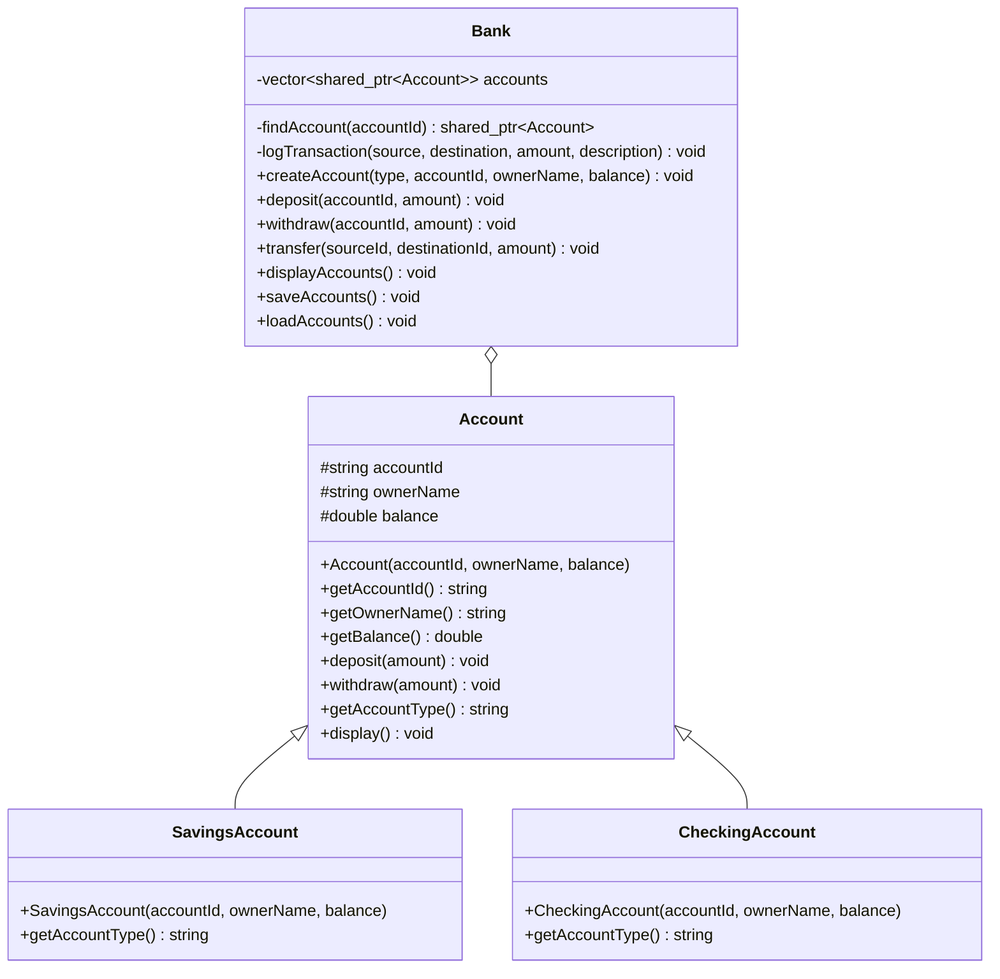
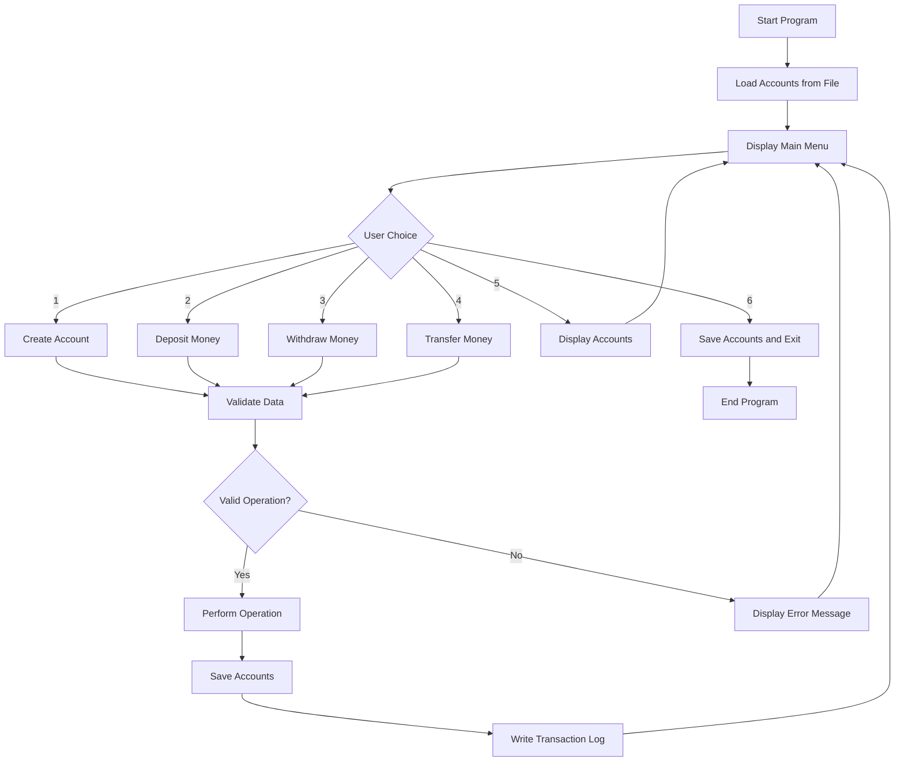

# 🏦 C++ Bank Management System

<div align="center">


A console-based Bank Management System developed using modern C++ and Object-Oriented Programming principles.

</div>

---

## 📌 Project Overview

This project is a simple and organized bank management system that runs in the terminal.

It allows users to:

* Create bank accounts
* Deposit money
* Withdraw money
* Transfer money between accounts
* Display all accounts
* Save account data to files
* Load account data when the program starts
* Record all transactions in a transaction log

The project demonstrates important C++ concepts such as inheritance, polymorphism, abstraction, encapsulation, smart pointers, STL containers, file handling, and exception handling.

---

## ✨ Features

### Account Management

* Create a Savings Account
* Create a Checking Account
* Assign a unique account ID
* Store the account owner's name
* Set an initial account balance

### Banking Operations

* Deposit money into an account
* Withdraw money from an account
* Transfer money between two accounts
* Prevent transfers to the same account
* Prevent withdrawals greater than the available balance

### File Handling

* Save all accounts in `accounts.txt`
* Load saved accounts when the program starts
* Append transaction records to `transactions.txt`
* Preserve account data after closing the program

### Error Handling

The system handles several invalid operations, including:

* Empty account IDs
* Empty owner names
* Negative initial balances
* Duplicate account IDs
* Invalid account types
* Non-positive deposits
* Non-positive withdrawals
* Insufficient balance
* Missing accounts
* Transfers to the same account
* Invalid menu input

---

## 🧠 Object-Oriented Programming Concepts

### Encapsulation

Account information is stored inside the `Account` class.

```cpp
protected:
    string accountId;
    string ownerName;
    double balance;
```

The data is accessed and modified using public member functions such as:

```cpp
getAccountId();
getOwnerName();
getBalance();
deposit();
withdraw();
```

---

### Inheritance

The `SavingsAccount` and `CheckingAccount` classes inherit from the base `Account` class.

```cpp
class SavingsAccount : public Account
```

```cpp
class CheckingAccount : public Account
```

---

### Abstraction

The `Account` class is an abstract base class.

```cpp
virtual string getAccountType() const = 0;
```

The pure virtual function prevents creating objects directly from `Account`.

---

### Polymorphism

The system stores different account types using base-class smart pointers.

```cpp
vector<shared_ptr<Account>> accounts;
```

The same vector can store:

```text
SavingsAccount
CheckingAccount
```

---

## 🏗️ Project Architecture

```text
Bank_System/
│
├── include/
│   ├── Account.h
│   ├── SavingsAccount.h
│   ├── CheckingAccount.h
│   └── Bank.h
│
├── src/
│   ├── Account.cpp
│   ├── SavingsAccount.cpp
│   ├── CheckingAccount.cpp
│   ├── Bank.cpp
│   └── main.cpp
│
├── data/
│   ├── accounts.txt
│   └── transactions.txt
│
├── README.md
└── report.md
```

---

## 📊 Class Diagram



---

## 🔄 Program Flow



---

## 🛠️ Technologies Used

* C++17
* Object-Oriented Programming
* STL `vector`
* Smart pointers
* `shared_ptr`
* `make_shared`
* STL algorithms
* `find_if`
* File streams
* Exception handling
* VS Code
* MinGW-w64
* PowerShell

---

## 📚 Required C++ Libraries

The project uses the following standard libraries:

```cpp
#include <algorithm>
#include <ctime>
#include <fstream>
#include <iomanip>
#include <iostream>
#include <limits>
#include <memory>
#include <sstream>
#include <stdexcept>
#include <string>
#include <vector>
```

---

## ⚙️ Compilation Instructions

### Requirements

Make sure the following tools are installed:

* Visual Studio Code
* C++ extension for VS Code
* MinGW-w64 or MSYS2
* `g++` compiler with C++17 support

Check the compiler installation using:

```powershell
g++ --version
```

---

### Open the Project Folder

Open PowerShell or the VS Code terminal inside:

```text
Bank_System
```

Your terminal path should look similar to:

```text
C:\Users\YourName\Desktop\Bank_System
```

---

### Compile the Project

Run:

```powershell
g++ -std=c++17 .\src\Account.cpp .\src\SavingsAccount.cpp .\src\CheckingAccount.cpp .\src\Bank.cpp .\src\main.cpp -I.\include -o BankSystem.exe
```

Explanation:

```text
-std=c++17
```

Uses the C++17 standard.

```text
.\src\Account.cpp ...
```

Specifies all source files.

```text
-I.\include
```

Tells the compiler where the header files are located.

```text
-o BankSystem.exe
```

Sets the executable file name.

---

### Run the Program

After successful compilation, run:

```powershell
.\BankSystem.exe
```

---

## 🖥️ Main Menu

```text
========== Bank System ==========
1. Create Account
2. Deposit Money
3. Withdraw Money
4. Transfer Money
5. Display Accounts
6. Exit
Enter your choice:
```

---

## 📝 Example Usage

### Create a Savings Account

```text
Choose account type: 1
Enter account ID: 1001
Enter owner name: Mohamed Ahmed
Enter initial balance: 5000

Account created successfully.
```

### Create a Checking Account

```text
Choose account type: 2
Enter account ID: 1002
Enter owner name: Ahmed Ali
Enter initial balance: 3000

Account created successfully.
```

### Deposit Money

```text
Enter account ID: 1001
Enter deposit amount: 500

Money deposited successfully.
```

### Withdraw Money

```text
Enter account ID: 1001
Enter withdrawal amount: 1000

Money withdrawn successfully.
```

### Transfer Money

```text
Enter source account ID: 1001
Enter destination account ID: 1002
Enter transfer amount: 500

Money transferred successfully.
```

---

## 💾 Accounts File Format

Account data is stored in:

```text
data/accounts.txt
```

Example:

```text
Savings|1001|Mohamed Ahmed|4000
Checking|1002|Ahmed Ali|3500
```

Each line contains:

```text
Account Type | Account ID | Owner Name | Balance
```

---

## 📜 Transaction Log Format

Transactions are stored in:

```text
data/transactions.txt
```

Example:

```text
2026-08-01 01:30:00 | Source: 1001 | Destination/Operation: Deposit | Amount: 500 | Description: Money deposited
```

Each transaction contains:

* Date and time
* Source account
* Destination account or operation type
* Amount
* Description

---

## 🚨 Example Error Messages

### Duplicate Account ID

```text
Error: An account with this ID already exists.
```

### Invalid Deposit

```text
Error: Deposit amount must be greater than zero.
```

### Insufficient Balance

```text
Error: Insufficient balance.
```

### Account Not Found

```text
Error: Account not found.
```

### Same-Account Transfer

```text
Error: Cannot transfer to the same account.
```

### Invalid Input

```text
Error: Amount must be a number.
```

---

## 🧪 Suggested Test Cases

| Test                    | Input                     | Expected Result      |
| ----------------------- | ------------------------- | -------------------- |
| Create Savings Account  | ID `1001`, balance `5000` | Account created      |
| Create Checking Account | ID `1002`, balance `3000` | Account created      |
| Duplicate Account       | ID `1001`                 | Error message        |
| Deposit Money           | Deposit `500`             | Balance increases    |
| Negative Deposit        | Deposit `-100`            | Operation rejected   |
| Withdraw Money          | Withdraw `1000`           | Balance decreases    |
| Excessive Withdrawal    | Withdraw `100000`         | Insufficient balance |
| Transfer Money          | `1001` to `1002`          | Balances updated     |
| Same Account Transfer   | `1001` to `1001`          | Operation rejected   |
| Missing Account         | ID `9999`                 | Account not found    |

---

## 📈 Future Improvements

Possible future improvements include:

* User authentication
* Admin and customer roles
* Account search
* Delete account functionality
* Update account information
* Interest calculation
* Overdraft support
* Monthly bank statements
* Graphical user interface
* Database integration
* Password encryption

These improvements are not included in the current required version.

---

## ✅ Project Requirements Covered

* [x] Encapsulation
* [x] Inheritance
* [x] Polymorphism
* [x] Abstraction
* [x] Abstract base class
* [x] Savings account
* [x] Checking account
* [x] Smart pointers
* [x] STL vector
* [x] STL algorithm
* [x] File saving
* [x] File loading
* [x] Transaction logging
* [x] Exception handling
* [x] Input validation
* [x] Menu-driven interface
* [x] Separate header and source files
* [x] C++17 support

---

## 👨‍💻 Author

**Mohamed Abdelmajeed**

C++ Bank Management System
ITI Final Project

---

## 📄 License

This project was created for educational purposes.

You may use, modify, and improve the source code for learning and academic projects.

---

<div align="center">

### ⭐ Thank you for visiting the project

Made with C++ and Object-Oriented Programming

</div>
