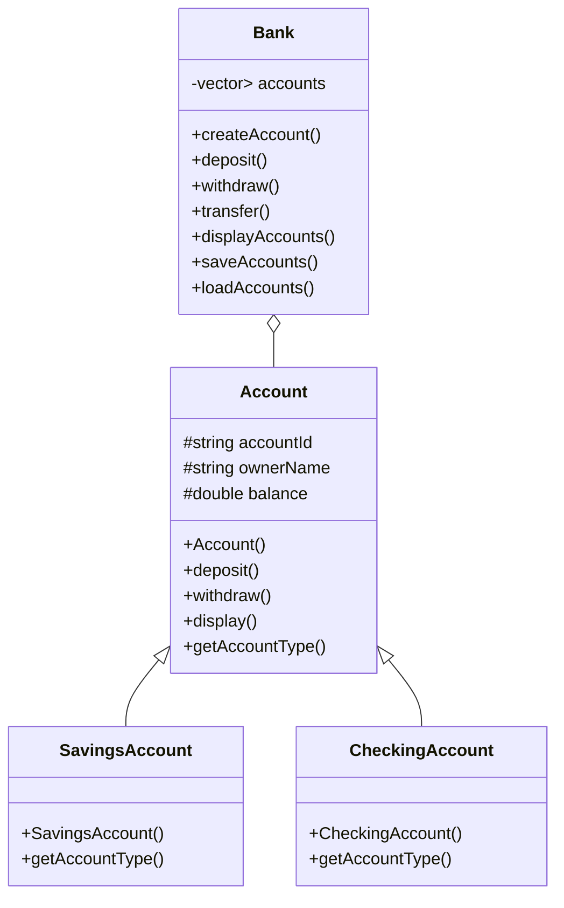
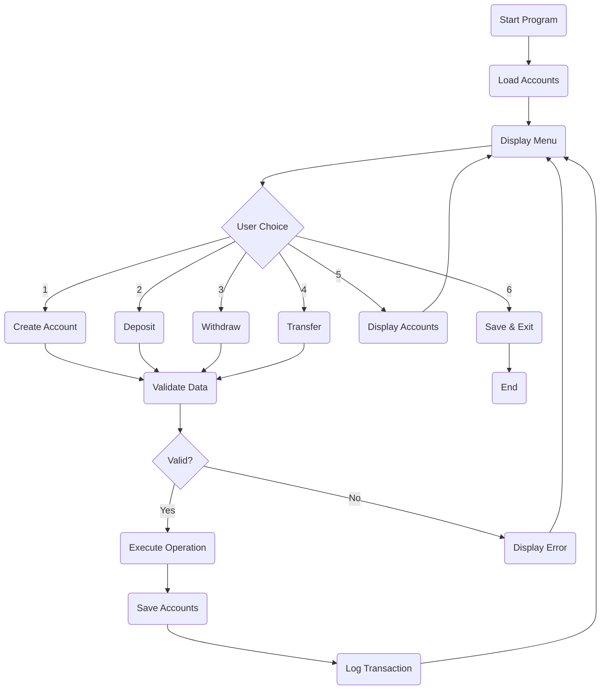

# Bank Management System Report

**Course:** C++ Programming / Object-Oriented Programming
**Project Title:** Bank Management System
**Language:** C++17
**Development Environment:** Visual Studio Code + MinGW-w64
**Operating System:** Windows

---

# Table of Contents

1. Introduction
2. Project Objectives
3. System Features
4. Software Architecture
5. Class Diagram
6. OOP Concepts
7. Data Structures
8. File Handling
9. Exception Handling
10. Program Flow
11. Sample Outputs
12. Project Structure
13. Future Improvements
14. Conclusion

---

# 1. Introduction

The **Bank Management System** is a console-based application developed using **C++17**. The project demonstrates the practical use of Object-Oriented Programming (OOP) principles while providing a simple banking system capable of creating accounts, performing banking transactions, storing data, and maintaining transaction history.

The application was designed with clean architecture by separating declarations into header files and implementations into source files. Modern C++ features such as Smart Pointers and STL containers are also utilized to improve code quality and memory management.

---

# 2. Project Objectives

The main objectives of this project are:

* Apply Object-Oriented Programming concepts.
* Implement a modular and maintainable system.
* Practice inheritance and polymorphism.
* Use Smart Pointers instead of raw pointers.
* Store account information permanently using files.
* Handle invalid operations using exception handling.
* Build a simple banking application with a user-friendly menu.

---

# 3. System Features

The system supports the following operations:

### Account Management

* Create Savings Account
* Create Checking Account
* Unique Account ID
* Store owner's name
* Initial balance

### Banking Operations

* Deposit money
* Withdraw money
* Transfer money
* Display all accounts

### Data Persistence

* Save accounts to file
* Load accounts at startup
* Save transaction history

### Validation

* Duplicate account detection
* Invalid balance prevention
* Invalid account handling
* Insufficient balance checking
* Invalid transfer checking

---

# 4. Software Architecture

The project follows a layered object-oriented design.

```text
+----------------------+
|      main.cpp        |
|   User Interface     |
+----------+-----------+
           |
           v
+----------------------+
|      Bank Class      |
| Business Logic Layer |
+----------+-----------+
           |
           v
+----------------------+
|    Account Classes   |
+----------+-----------+
           |
      +----+----+
      |         |
      v         v
Savings      Checking
Account      Account
```

The `main.cpp` file only communicates with the `Bank` class, while the `Bank` class manages all account objects.

---

# 5. Class Diagram



---

# 6. Object-Oriented Programming Concepts

## Encapsulation

The account information is stored as protected data members.

```cpp
protected:
    string accountId;
    string ownerName;
    double balance;
```

The data can only be accessed through public member functions.

Examples:

* getAccountId()
* getOwnerName()
* getBalance()
* deposit()
* withdraw()

---

## Inheritance

Both account types inherit from the base Account class.

```cpp
class SavingsAccount : public Account
```

```cpp
class CheckingAccount : public Account
```

This avoids duplicate code and improves maintainability.

---

## Abstraction

The Account class is abstract.

```cpp
virtual string getAccountType() const = 0;
```

This ensures that every derived account type defines its own account type.

---

## Polymorphism

The Bank class stores different account types inside one container.

```cpp
vector<shared_ptr<Account>> accounts;
```

The vector can contain both:

* SavingsAccount
* CheckingAccount

The appropriate overridden function is called automatically at runtime.

---

# 7. Data Structures

The project uses the following Standard Template Library (STL) containers.

## Vector

```cpp
vector<shared_ptr<Account>> accounts;
```

Purpose:

* Store all account objects.
* Allow dynamic resizing.
* Easy iteration.

---

## Smart Pointer

```cpp
shared_ptr<Account>
```

Advantages:

* Automatic memory management.
* Prevents memory leaks.
* Eliminates manual delete operations.

---

## STL Algorithm

```cpp
find_if()
```

Used to search for an account by its ID.

Benefits:

* Cleaner code
* Faster implementation
* Modern C++ practice

---

# 8. File Handling

The project stores data in text files.

## Accounts File

```text
accounts.txt
```

Example

```text
Savings|1001|Mohamed Ahmed|5000
Checking|1002|Ahmed Ali|3000
```

Each line contains:

* Account Type
* Account ID
* Owner Name
* Balance

---

## Transactions File

```text
transactions.txt
```

Example

```text
2026-08-01 10:15:30
Source:1001
Destination:1002
Amount:500
Description:Transfer
```

Every banking operation is automatically recorded.

---

# 9. Exception Handling

The project uses C++ exception handling to prevent unexpected program termination.

```cpp
try
{
    ...
}
catch(const exception& error)
{
    cout << error.what();
}
```

Handled Exceptions include:

* Empty account ID
* Empty owner name
* Negative balance
* Invalid account type
* Duplicate account
* Invalid deposit
* Invalid withdrawal
* Insufficient balance
* Missing account
* Invalid transfer

---

# 10. Program Flow



---

# 11. Sample Outputs

## Main Menu

```text
========== Bank System ==========
1. Create Account
2. Deposit Money
3. Withdraw Money
4. Transfer Money
5. Display Accounts
6. Exit
```

---

## Display Accounts

```text
Account ID : 1001
Owner Name : Mohamed Ahmed
Type       : Savings
Balance    : 4500

------------------------

Account ID : 1002
Owner Name : Ahmed Ali
Type       : Checking
Balance    : 3500
```

---

## Error Example

```text
Error:
Insufficient balance.
```

---

# 12. Project Structure

```text
Bank_System
│
├── include
│   ├── Account.h
│   ├── SavingsAccount.h
│   ├── CheckingAccount.h
│   └── Bank.h
│
├── src
│   ├── Account.cpp
│   ├── SavingsAccount.cpp
│   ├── CheckingAccount.cpp
│   ├── Bank.cpp
│   └── main.cpp
│
├── data
│   ├── accounts.txt
│   └── transactions.txt
│
├── README.md
└── report.md
```

---

# 13. Future Improvements

The following features could be added in future versions:

* User authentication
* Password encryption
* Administrator panel
* Search accounts
* Delete account
* Edit account information
* Interest calculation
* Monthly reports
* Database integration
* Graphical User Interface (GUI)

---

# 14. Conclusion

The Bank Management System successfully demonstrates the use of modern C++ programming techniques and Object-Oriented Programming principles. The project is modular, maintainable, and easy to extend. It satisfies the required functionality for a simple banking system while following good software engineering practices such as encapsulation, inheritance, abstraction, polymorphism, exception handling, file persistence, and code organization.

The project provides a strong foundation for developing larger financial management systems in the future.
