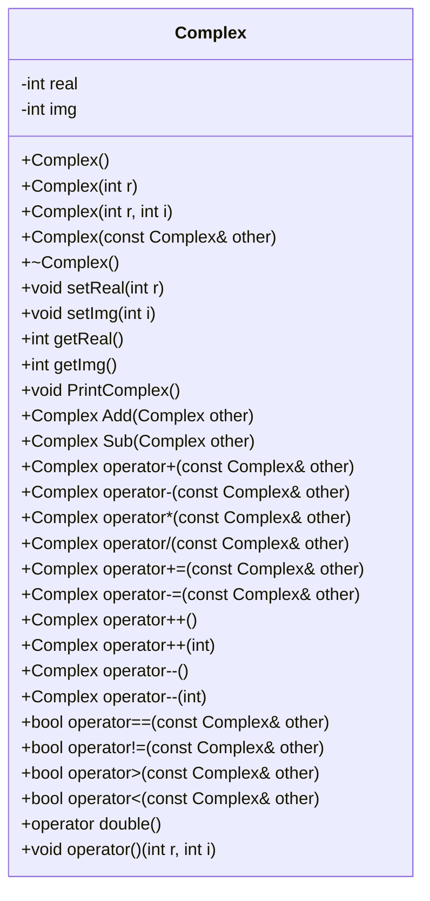
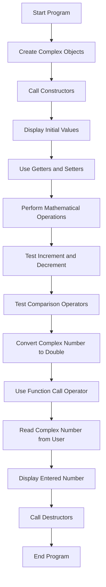
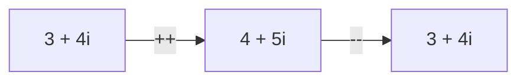
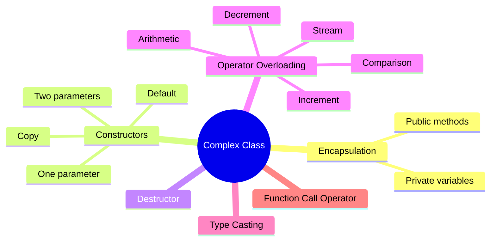

# Complex Number Class in C++


A C++ project that implements a custom `Complex` class for working with complex numbers.

The project demonstrates important Object-Oriented Programming concepts such as constructors, destructors, encapsulation, operator overloading, type casting, and function call operators.

---

## Table of Contents

- [Project Overview](#project-overview)
- [Features](#features)
- [Complex Number Format](#complex-number-format)
- [Class Diagram](#class-diagram)
- [Program Flow](#program-flow)
- [Constructors](#constructors)
- [Supported Operators](#supported-operators)
- [Project Structure](#project-structure)
- [How to Compile and Run](#how-to-compile-and-run)
- [Example Usage](#example-usage)
- [Example Output](#example-output)
- [Learning Objectives](#learning-objectives)
- [Future Improvements](#future-improvements)
- [Author](#author)

---

## Project Overview

A complex number has two parts:

```text
a + bi
```

Where:

- `a` is the real part.
- `b` is the imaginary part.
- `i` is the imaginary unit.

The `Complex` class stores the real and imaginary values using two private integer variables:

```cpp
int real;
int img;
```

The class allows users to create, modify, compare, print, and perform mathematical operations on complex numbers.

---

## Features

- Default constructor
- One-parameter constructor
- Two-parameter constructor
- Copy constructor
- Destructor
- Getters and setters
- Addition and subtraction functions
- Mathematical operator overloading
- Increment and decrement operators
- Comparison operators
- Input and output stream operators
- Type casting to `double`
- Function call operator
- Complex number formatting

---

## Complex Number Format

The program prints complex numbers in a readable format.

| Stored values | Printed result |
|---|---|
| `real = 0`, `img = 0` | `0` |
| `real = 5`, `img = 0` | `5` |
| `real = 0`, `img = 4` | `4i` |
| `real = 3`, `img = 4` | `3 + 4i` |
| `real = 3`, `img = -4` | `3 - 4i` |

---

## Class Diagram



---

## Program Flow



---

## Constructors

### Default Constructor

Creates a complex number with both values equal to zero.

```cpp
Complex c1;
```

Result:

```text
0
```

---

### One-Parameter Constructor

Sets both the real and imaginary parts to the same value.

```cpp
Complex c2(5);
```

Result:

```text
5 + 5i
```

---

### Two-Parameter Constructor

Sets the real and imaginary parts separately.

```cpp
Complex c3(3, 4);
```

Result:

```text
3 + 4i
```

---

### Copy Constructor

Creates a new object by copying another object.

```cpp
Complex c4(c3);
```

---

## Supported Operators

### Mathematical Operators

| Operator | Description |
|---|---|
| `+` | Adds two complex numbers |
| `-` | Subtracts two complex numbers |
| `*` | Multiplies two complex numbers |
| `/` | Divides two complex numbers |
| `+=` | Adds and updates the current object |
| `-=` | Subtracts and updates the current object |

Example:

```cpp
Complex c1(3, 4);
Complex c2(2, 1);

Complex sum = c1 + c2;
Complex difference = c1 - c2;
Complex product = c1 * c2;
Complex division = c1 / c2;
```

---

### Increment and Decrement Operators

The increment and decrement operators change both the real and imaginary parts.

```cpp
++c1;
c1++;
--c1;
c1--;
```



---

### Comparison Operators

| Operator | Description |
|---|---|
| `==` | Checks whether both parts are equal |
| `!=` | Checks whether the objects are different |
| `>` | Compares magnitudes |
| `<` | Compares magnitudes |

The magnitude of a complex number is calculated using:

```text
Magnitude = √(real² + imaginary²)
```

For example:

```text
3 + 4i

Magnitude = √(3² + 4²)
          = √(9 + 16)
          = √25
          = 5
```

---

### Stream Operators

The output stream operator allows a complex number to be printed using `cout`.

```cpp
cout << c1;
```

The input stream operator allows the user to enter a complex number using `cin`.

```cpp
cin >> c1;
```

---

### Type Casting

A `Complex` object can be converted to a `double`.

The returned value is the magnitude of the complex number.

```cpp
Complex c1(3, 4);

double value = c1;
```

Result:

```text
5
```

---

### Function Call Operator

The function call operator allows the object to be used like a function.

```cpp
Complex c1;

c1(10, 7);
```

This changes the object to:

```text
10 + 7i
```

---

## Mathematical Operations

### Addition

```text
(a + bi) + (c + di)

= (a + c) + (b + d)i
```

### Subtraction

```text
(a + bi) - (c + di)

= (a - c) + (b - d)i
```

### Multiplication

```text
(a + bi)(c + di)

= (ac - bd) + (ad + bc)i
```

### Division

```text
(a + bi) / (c + di)

Real part:
(ac + bd) / (c² + d²)

Imaginary part:
(bc - ad) / (c² + d²)
```

---

## Project Structure

```text
Complex-Class/
│
├── main.cpp
└── README.md
```

---

## How to Compile and Run

### Requirements

- A C++ compiler
- GCC, MinGW, Clang, or Visual Studio
- C++11 or later

### Compile with g++

```bash
g++ main.cpp -o complex
```

### Run on Windows

```bash
complex.exe
```

### Run on Linux or macOS

```bash
./complex
```

---

## Example Usage

```cpp
Complex c1;
Complex c2(5);
Complex c3(3, 4);
Complex c4(c3);

Complex sum = c2 + c3;
Complex sub = c2 - c3;
Complex multiply = c2 * c3;
Complex divide = c2 / c3;

cout << "Sum = " << sum << endl;
cout << "Subtraction = " << sub << endl;
cout << "Multiplication = " << multiply << endl;
cout << "Division = " << divide << endl;
```

---

## Example Output

```text
Default constructor used
One parameter constructor used
Two parameter constructor used
Copy constructor used

C1 = 0
C2 = 5 + 5i
C3 = 3 + 4i
C4 = 3 + 4i

After using setters:
C1 = 2 + 3i
Real part = 2
Imaginary part = 3

Math operators:
C2 + C3 = 8 + 9i
C2 - C3 = 2 + 1i
C2 * C3 = -5 + 35i
C2 / C3 = 1

Increment operators:
C1 before increment = 2 + 3i
++C1 = 3 + 4i
C1++ = 3 + 4i
C1 after increment = 4 + 5i

Comparison operators:
C2 == C3: false
C2 != C3: true
C2 > C3: true
C2 < C3: false

Magnitude of C3 = 5

After function call operator:
C1 = 10 + 7i
```

> The division result uses integer variables, so decimal values are removed.

---

## OOP Concepts Used



---

## Learning Objectives

This project helps students understand:

- How to create a class in C++
- How constructors initialize objects
- How a copy constructor works
- How destructors are called
- How private variables protect class data
- How getters and setters access private data
- How operator overloading works
- How friend functions access private members
- How prefix and postfix operators differ
- How to compare custom objects
- How to convert an object to another data type

---

## Future Improvements

- Change `int` values to `double` for more accurate division
- Add assignment operator overloading
- Add validation for user input
- Add more comparison operators
- Add a conjugate function
- Add a magnitude function
- Remove constructor messages from the final version
- Split the class into header and source files

Suggested structure:

```text
Complex-Class/
│
├── Complex.h
├── Complex.cpp
├── main.cpp
└── README.md
```

---

## Author

**Ella Matthew**

Computer Science Student

---

## License

This project is created for educational purposes.