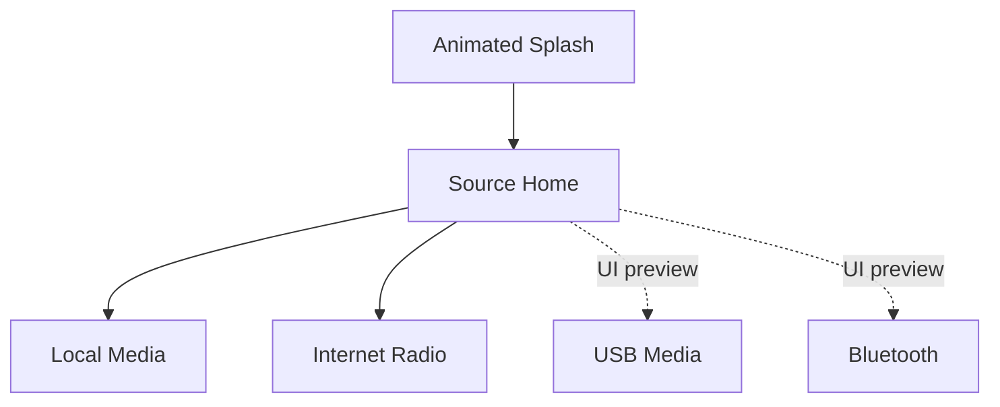
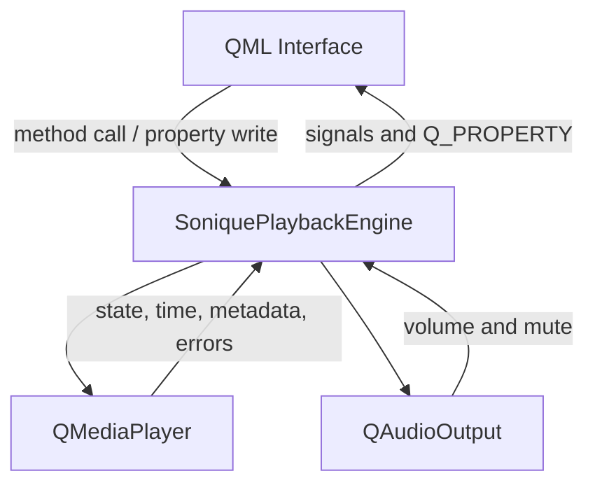

<div align="center">


<br>


### A premium in-vehicle audio experience built with Qt Quick and C++

Local music and live radio come together in one responsive, touch-friendly
interface with animated navigation, real playback controls, dynamic metadata,
and a clean dark cockpit aesthetic.

</div>

---

## ✦ Overview

**Sonique IVI Audio** is a desktop demonstration of an in-vehicle infotainment
audio player. The interface is written in QML, while a C++ playback engine uses
Qt Multimedia to play local files and internet radio streams.

The project focuses on three qualities:

- **Premium presentation** — deep navy surfaces, cyan energy accents, and warm
  gold controls.
- **Simple interaction** — large touch targets, clear states, and one dynamic
  playback page.
- **Real architecture** — QML handles presentation while C++ owns media state,
  file discovery, metadata, radio stations, and audio output.

<div align="center">
  
</div>

## ✦ Experience



1. The app opens with an animated Sonique splash screen.
2. The Home page presents four clearly separated audio sources.
3. Selecting a source opens the reusable playback page.
4. QML calls the C++ playback engine when the user presses a control.
5. Backend signals update the title, author, time, progress, volume, playback
   state, station information, buffering state, and errors.

## ✦ Feature Matrix

| Capability | Local Media | Internet Radio | USB | Bluetooth |
| --- | :---: | :---: | :---: | :---: |
| Premium source page | ✅ | ✅ | ✅ | ✅ |
| Real C++ playback | ✅ | ✅ | — | — |
| Play / pause / stop | ✅ | ✅ | — | — |
| Previous / next | ✅ | ✅ | — | — |
| Seek and elapsed time | ✅ | Live stream | — | — |
| Volume and mute | ✅ | ✅ | — | — |
| Dynamic metadata | ✅ | When supplied by stream | — | — |
| Folder selection | ✅ | — | — | — |
| Built-in source catalog | — | ✅ | — | — |

> [!NOTE]
> USB and Bluetooth currently demonstrate the finished frontend design. Their
> device-detection and streaming backends are planned extensions.

## ✦ Local Media

Choose a folder and Sonique builds a local playlist from supported files:

| Format | Extension |
| --- | --- |
| MPEG Audio | `.mp3` |
| Waveform Audio | `.wav` |
| MPEG-4 Audio | `.m4a` |
| Advanced Audio Coding | `.aac` |
| Free Lossless Audio Codec | `.flac` |
| Ogg Audio | `.ogg` |

The first discovered track is loaded immediately. The backend reads available
title, author, album, and genre tags through `QMediaMetaData`. When a title tag
is missing, Sonique falls back to the file name.

## ✦ Internet Radio

The station catalog is based on the radio list supplied with the original
backend:

| # | Station | Country |
| ---: | --- | --- |
| 1 | Quran Radio Cairo | Egypt |
| 2 | Saudi Quran Radio | Saudi Arabia |
| 3 | Quran Radio Nablus | Palestine |
| 4 | Quran Radio | Saudi Arabia |

The Previous and Next controls cycle through the catalog. Live metadata appears
only when the station server sends it; otherwise the interface displays the
station name and country.

## ✦ Architecture



### Layer responsibilities

| Layer | Responsibility |
| --- | --- |
| `Main.qml` | Window, splash visibility, navigation, and backend injection |
| `HomePage.qml` | Source selection and IVI dashboard presentation |
| `SourceCard.qml` | Reusable interactive source card |
| `SourcePage.qml` | Dynamic playback UI and backend commands |
| `SoniquePlaybackEngine` | Playback state, playlist, metadata, radio, errors |
| `QMediaPlayer` | Decoding, timing, streaming, and media state |
| `QAudioOutput` | System volume and mute output |

## ✦ Project Structure

```text
Sonique_IVIAudioPlayer/
├── CMakeLists.txt
├── main.cpp
├── soniqueplaybackengine.h
├── soniqueplaybackengine.cpp
├── Main.qml
├── SplashScreen.qml
├── HomePage.qml
├── SourceCard.qml
├── SourcePage.qml
├── IVILogo.qml
├── resources.qrc
├── BACKEND_INTEGRATION.md
└── assets/
    ├── icons/
    │   ├── back.svg
    │   ├── folder.svg
    │   ├── local-audio.svg
    │   ├── radio.svg
    │   ├── bluetooth.svg
    │   ├── usb.svg
    │   ├── previous.svg
    │   ├── play.svg
    │   ├── pause.svg
    │   ├── next.svg
    │   ├── stop.svg
    │   ├── volume-high.svg
    │   └── volume-muted.svg
    └── images/
        ├── midnight-drive.svg
        └── readme-banner.svg
```

## ✦ Backend API

The application exposes one C++ object to QML as `soniquePlaybackEngine`.

### Core properties

| QML property | Meaning |
| --- | --- |
| `playbackActive` | Whether media is currently playing |
| `playheadMs` | Current position in milliseconds |
| `mediaLengthMs` | Total local-track duration |
| `silenceEnabled` | Current mute state |
| `outputLevel` | Volume from `0.0` to `1.0` |
| `localTracks` | Audio files found in the selected folder |
| `trackTitle` | Current metadata title |
| `trackArtist` | Current metadata author/artist |
| `trackAlbum` | Current metadata album |
| `trackGenre` | Current metadata genre |
| `stationCatalog` | Available internet radio stations |
| `tunedStationName` | Active radio station |
| `streamBuffering` | Whether the radio stream is connecting |
| `lastPlaybackError` | Latest user-facing playback error |

### Commands

| Method | Action |
| --- | --- |
| `togglePlayback()` | Toggle play and pause |
| `stopPlayback()` | Stop the active media |
| `playPrevious()` | Previous track or station |
| `playNext()` | Next track or station |
| `seekTo(milliseconds)` | Move within a local track |
| `loadLocalFolder(url)` | Scan a folder and build the playlist |
| `useLocalLibrary()` | Leave radio mode and restore local media |
| `tuneStation(index)` | Start a selected radio stream |
| `saveStation(...)` | Add a validated radio station |
| `formatClock(milliseconds)` | Format time as `MM:SS` or `HH:MM:SS` |

See [`BACKEND_INTEGRATION.md`](BACKEND_INTEGRATION.md) for the full mapping
between the supplied `AudioPlayer` API and the renamed Sonique API.

## ✦ Requirements

- Qt **6.8 or newer**
- Qt Quick
- Qt Quick Controls 2
- Qt Quick Dialogs 2
- Qt Multimedia
- CMake **3.16 or newer**
- A compiler with C++17 support
- FFmpeg/GStreamer media support provided by the selected Qt kit
- An internet connection for radio playback

## ✦ Build with Qt Creator

1. Extract the project to a simple location such as:

   ```text
   /home/yourname/QtProjects/Sonique_IVIAudioPlayer
   ```

2. Avoid spaces and parentheses in project and build paths.
3. Open `CMakeLists.txt` in Qt Creator.
4. Select a Desktop Qt 6.8+ kit containing Qt Multimedia.
5. Choose **Configure Project**.
6. Build and run.

> [!IMPORTANT]
> If the project is moved, delete its old `build` directory before configuring
> it again. `CMakeCache.txt` stores the original absolute source path.

## ✦ Build from Terminal

```bash
cmake -S . -B build -DCMAKE_BUILD_TYPE=Release
cmake --build build --parallel
./build/appIVIAudioPlayer
```

For a clean rebuild:

```bash
cmake --build build --target clean
cmake --build build --parallel
```

## ✦ Using Sonique

### Play local audio

1. Select **Local Media** from the Home page.
2. Press the folder icon.
3. Choose a folder containing supported audio files.
4. Press Play.
5. Use Previous, Next, Stop, progress, volume, and mute as needed.

### Play radio

1. Select **Radio** from the Home page.
2. Sonique tunes the first configured station.
3. Use Previous and Next to change stations.
4. The page shows stream metadata when the server provides it.

### Return home

The Back action calls `stopPlayback()` before removing the source page, so
audio does not continue after returning to Home.

## ✦ Troubleshooting

<details>
<summary><strong>CMake says the cache belongs to another directory</strong></summary>

The project was moved while keeping an old build cache. Close Qt Creator,
delete only the generated `build` folder, reopen `CMakeLists.txt`, and configure
again.

</details>

<details>
<summary><strong>The shell reports: Syntax error: "(" unexpected</strong></summary>

Rename source and build folders so their paths contain no parentheses. Prefer
`Sonique_IVIAudioPlayer` instead of `Sonique_IVIAudioPlayer(2)`.

</details>

<details>
<summary><strong>The Linux folder chooser opens slowly</strong></summary>

Use `FolderDialog.DontUseNativeDialog`, start at `MusicLocation`, and avoid
resolving symbolic links. This bypasses a slow native GTK folder chooser.

</details>

<details>
<summary><strong>Radio plays but title or author is empty</strong></summary>

Internet radio metadata depends on the stream server. If a station sends audio
without ICY/media tags, the app can show only its configured station name and
country.

</details>

<details>
<summary><strong>A local file has “Unknown author”</strong></summary>

The audio file does not contain an author/artist metadata tag. Add tags using a
media tag editor and reload the folder.

</details>

## ✦ Design System

| Token | Color | Purpose |
| --- | --- | --- |
| Midnight | `#030A12` | Main cockpit background |
| Deep panel | `#09121C` | Cards and controls |
| Electric cyan | `#28D9F2` | Energy, connection, and volume |
| Sonique gold | `#E8B864` | Premium controls and progress |
| Primary text | `#F5F7FA` | Main readable content |
| Secondary text | `#91A0AE` | Supporting information |

The included SVG icons remain sharp at any display scale and are embedded using
Qt's Resource System.

## ✦ Roadmap

- [ ] USB device discovery and safe eject
- [ ] Bluetooth pairing and streamed playback
- [ ] Asynchronous folder scanning for very large libraries
- [ ] Dynamic embedded album artwork
- [ ] Editable radio station management page
- [ ] Favorites and persistent settings
- [ ] Localization and runtime language switching

---

<div align="center">

### SONIQUE

**Drive the sound. Own the journey.**

Built with Qt 6 · QML · C++17 · CMake

</div>
