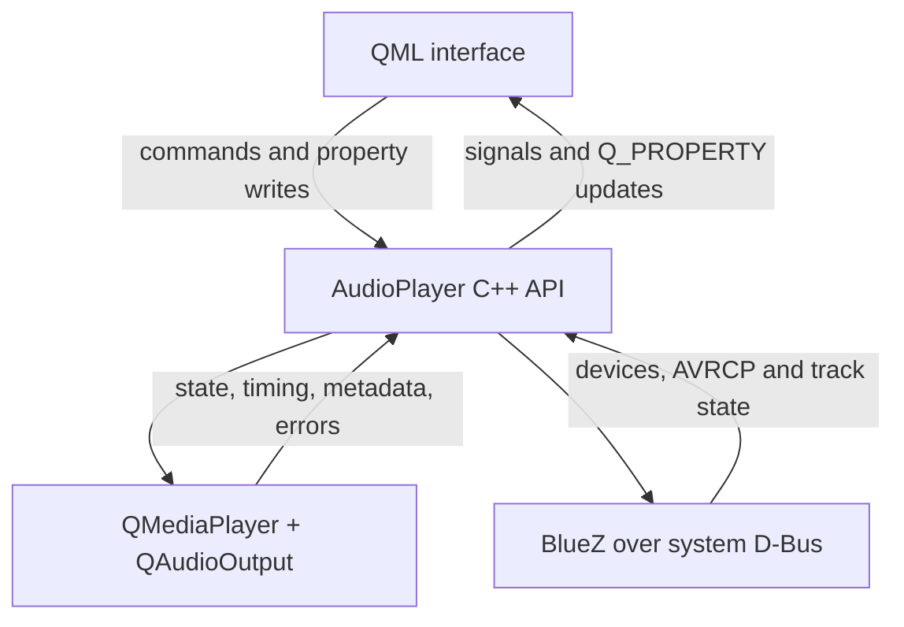
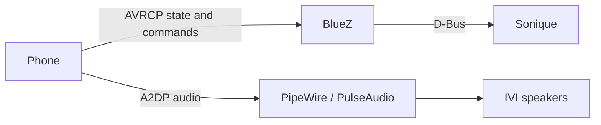

<div align="center">


<br>


### A touch-first audio cockpit for local music, radio, USB and Bluetooth

**Sonique IVI Audio** combines a premium QML interface with real Qt Multimedia,
USB-library and Linux BlueZ/AVRCP backends in one focused in-vehicle experience.

[Features](#features) · [Architecture](#architecture) · [Build](#build-and-run) · [Bluetooth](#bluetooth-on-linux) · [Troubleshooting](#troubleshooting)

</div>

---

## Overview

Sonique is a responsive infotainment audio application built with **Qt 6**, **QML**
and **C++17**. It presents four audio sources through one reusable playback page,
one state-driven control system and a cohesive midnight-cockpit design.

The interface is not a static prototype. The C++ `AudioPlayer` backend owns media
playback, metadata, playlists, radio streams, USB scanning, BlueZ discovery,
Bluetooth connection state and AVRCP transport commands.


### Product principles

| Principle | What it means in Sonique |
| --- | --- |
| **Driver-first clarity** | Large targets, concise statuses and low visual noise |
| **One coherent experience** | The same player layout and controls adapt to every source |
| **Real backend state** | UI states are driven by Qt Multimedia and BlueZ—not hard-coded demos |
| **Premium motion** | Smooth navigation and a 40-bar playback visualizer rendered at display refresh rate |
| **Human-readable Bluetooth** | Device names come from BlueZ `Alias` / `Name`; MAC addresses remain internal |

## Features

### Four integrated audio sources

| Capability | Local Media | Internet Radio | USB Media | Bluetooth |
| --- | :---: | :---: | :---: | :---: |
| Real backend | Qt Multimedia | Qt Multimedia | Qt Multimedia | BlueZ D-Bus / AVRCP |
| Play / pause / stop | ✅ | ✅ | ✅ | ✅ When AVRCP is available |
| Previous / next | ✅ | Station cycle | ✅ | ✅ When AVRCP is available |
| Seek | ✅ | Live stream | ✅ | Read-only position |
| Metadata | Embedded tags | Stream-dependent | Embedded tags | AVRCP track metadata |
| Volume / mute | App controlled | App controlled | App controlled | System A2DP controlled |
| Discovery | Folder | Built-in catalog | Automatic mount + recursive scan | BlueZ device discovery |
| Friendly device name | — | — | — | ✅ No visible MAC address |

### Playback experience

- Animated splash and polished `StackView` transitions.
- Shared play, pause, previous, next and stop controls.
- Writable progress seeking for local and USB tracks.
- Dynamic title, artist, album and genre metadata.
- Radio buffering/reconnection state.
- Consistent mute and volume state for Qt Multimedia sources.
- Source-aware statuses such as `LIVE SIGNAL`, `USB CONNECTED` and
  `PHONE CONNECTED`.
- Smooth 40-bar waveform that reacts to real playback state across all sources.
- Touch-friendly layouts from the minimum 960 × 640 window size upward.

## Visual experience

| Artwork | Design language |
| --- | --- |
|  | **Midnight surfaces** create a focused cockpit.<br><br>**Electric cyan** communicates energy and playback.<br><br>**Warm gold** marks primary controls and premium detail.<br><br>**Violet and emerald** distinguish USB and Bluetooth states.<br><br>All icons and repository visuals are resolution-independent SVG assets. |

### Design tokens

| Token | Value | Purpose |
| --- | --- | --- |
| Midnight | `#030A12` | Primary cockpit background |
| Deep panel | `#09121C` | Cards, dialogs and control surfaces |
| Electric cyan | `#28D9F2` | Audio energy, active playback and connection accents |
| Sonique gold | `#E8B864` | Primary actions, progress and premium emphasis |
| USB violet | `#9D7BFF` | Portable-media identity |
| Bluetooth green | `#4BE3A6` | Connected and ready states |
| Primary text | `#F5F7FA` | High-contrast titles and content |
| Secondary text | `#91A0AE` | Metadata and supporting information |

## Audio sources

### Local Media

Choose a folder and Sonique creates a sorted playlist from supported audio files
in that directory. Qt Multimedia loads the track, exposes timing and embedded
metadata, and uses the filename as a title fallback when a title tag is missing.

### Internet Radio

The included station catalog provides four internet streams. Previous and Next
cycle through stations while the backend reports loading, buffering and stalled
states through the `radioReconnecting` property. Track metadata appears when the
stream server publishes it.

### USB Media

Open the USB source and Sonique automatically detects a mounted flash drive—no
folder picker is required. The backend resolves removable storage through
`QStorageInfo`, standard Linux media mount points and sysfs USB/removable flags,
then scans the drive root recursively. A 1.5-second monitor detects later
insertion or removal while the USB page is active. The common Qt Multimedia
controls are reused after the first track is loaded.

### Bluetooth

On Linux, Sonique communicates with BlueZ over the system D-Bus:

- Detects the Bluetooth adapter and its discovery state.
- Lists nearby and paired devices.
- Pairs unpaired devices before connecting.
- Prefers an active A2DP/AVRCP audio device over unrelated peripherals.
- Reads the user-facing device name from BlueZ `Alias` and `Name`.
- Keeps MAC addresses out of the visible interface.
- Reads AVRCP status, position and track metadata from `MediaPlayer1`.
- Forwards Play, Pause, Previous, Next and Stop commands to the phone.


## Premium waveform

The playback waveform is shared by Local Media, Radio, USB and Bluetooth. It is
a 40-bar, center-weighted visualizer driven by continuously interpolated travelling
waves—not stepped random updates.

- **2.4-second master motion cycle** for calm, premium pacing.
- **Display-refresh animation** through QML `NumberAnimation`.
- **Layered forward, return and detail waves** for organic movement.
- **Fast energy ramp-up** when playback begins.
- **Soft 360 ms release** into a clean idle baseline.
- Stops for muted or zero-volume Qt Multimedia output.
- Follows AVRCP playback state for Bluetooth because A2DP volume belongs to the
  Linux audio session.

## Supported audio formats

| Format | Extension |
| --- | --- |
| MPEG Audio | `.mp3` |
| Waveform Audio | `.wav` |
| MPEG-4 Audio | `.m4a` |
| Advanced Audio Coding | `.aac` |
| Free Lossless Audio Codec | `.flac` |
| Ogg Audio | `.ogg` |

Actual decoding support also depends on the media backend available to the Qt kit
(typically FFmpeg or GStreamer).

## Architecture



### Layer responsibilities

| Layer | Responsibility |
| --- | --- |
| `Main.qml` | Application window, backend instance, splash and navigation stack |
| `SplashScreen.qml` | Startup presentation and handoff animation |
| `HomePage.qml` | Four-source dashboard and source routing |
| `SourceCard.qml` | Reusable interactive source card |
| `SourcePage.qml` | Playback view, device/folder dialogs, controls and waveform |
| `IVILogo.qml` | Reusable vector-style Sonique mark |
| `AudioPlayer` | Source state, playback, scanning, metadata, BlueZ and errors |
| `QMediaPlayer` | Local, USB and internet-radio decoding/playback |
| `QAudioOutput` | Qt Multimedia volume and mute output |
| BlueZ | Bluetooth discovery, pairing, connection and AVRCP objects |
| PipeWire / PulseAudio | Linux A2DP audio transport and routing |

### Bluetooth control and audio paths

Bluetooth control and Bluetooth audio deliberately use separate paths:



Sonique does not seize the raw A2DP transport. The system audio session owns and
routes Bluetooth audio, which avoids competing with PipeWire, WirePlumber or
PulseAudio.

## Backend API

The backend is registered with `QML_ELEMENT`, so `Main.qml` can instantiate
`AudioPlayer` directly without `setContextProperty()`.

### Core properties

| Group | Properties |
| --- | --- |
| Playback | `playing`, `position`, `duration` |
| Output | `muted`, `volume` |
| Local | `playlist`, `currentPlaylistIndex` |
| Radio | `isRadioMode`, `radioStations`, `currentRadioStationName`, `currentRadioStationCountry`, `radioReconnecting` |
| USB | `isUsbMode`, `usbConnected`, `usbRootPath`, `usbTracks`, `currentUsbTrackIndex` |
| Bluetooth | `isBluetoothMode`, `bluetoothAvailable`, `bluetoothScanning`, `bluetoothConnected`, `bluetoothDevices`, `bluetoothDeviceName`, `bluetoothPlaybackStatus`, `bluetoothMediaControlsAvailable` |
| Metadata / error | `audioTitle`, `audioAuthor`, `audioAlbum`, `audioType`, `errorString` |

### Main commands

| Command | Purpose |
| --- | --- |
| `playPause()`, `stop()` | Control the active source |
| `previous()`, `next()` | Change the active track, station or AVRCP item |
| `loadFolder(path)` | Load a local folder |
| `playRadioStation(index)` | Tune a configured radio station |
| `addRadioStation(name, url)` | Add a validated station at runtime |
| `loadUsbFolder(path)` | Recursively scan USB media |
| `detectUsbDrive()` | Detect and load a mounted flash drive automatically |
| `playUsbTrack(index)` | Play a selected USB track |
| `useBluetoothSource()` | Activate Bluetooth and synchronize BlueZ state |
| `startBluetoothDiscovery()` | Start BlueZ discovery |
| `connectBluetoothDevice(index)` | Pair/connect the selected device |
| `disconnectBluetoothDevice()` | Disconnect the active device |
| `formatTime(ms)` | Return `MM:SS` or `HH:MM:SS` display text |

See [BACKEND_INTEGRATION.md](BACKEND_INTEGRATION.md) for the full integration
notes and source-specific behavior.

## Requirements

### Core application

| Requirement | Minimum / component |
| --- | --- |
| Qt | **6.8** |
| CMake | **3.16** |
| C++ compiler | C++17 capable |
| Qt modules | Quick, Quick Controls 2, Quick Dialogs 2, Multimedia, D-Bus |
| Media backend | FFmpeg or GStreamer support in the chosen Qt kit |
| Display | 960 × 640 minimum; 1280 × 720 recommended |

### Bluetooth on Linux

- BlueZ running on the system bus.
- A working Bluetooth adapter.
- PipeWire + WirePlumber or PulseAudio for A2DP routing.
- A phone/device exposing AVRCP for remote media controls and metadata.

Local Media, Radio and USB use Qt Multimedia. The current Bluetooth backend is
specifically designed for Linux/BlueZ IVI systems.

## Build and run

### Qt Creator

1. Extract the project to a simple path without parentheses.
2. Open `CMakeLists.txt` in Qt Creator.
3. Select a Qt **6.8+** desktop kit containing Multimedia and D-Bus.
4. Choose **Configure Project**.
5. Build and run `appIVIAudioPlayer`.

> [!IMPORTANT]
> If the project is moved, remove only its generated build directory before
> configuring it again. `CMakeCache.txt` stores absolute source paths.

### Terminal

```bash
cmake -S . -B build -DCMAKE_BUILD_TYPE=Release
cmake --build build --parallel
./build/appIVIAudioPlayer
```

For a fresh rebuild, create a new build directory or clean the existing target:

```bash
cmake --build build --target clean
cmake --build build --parallel
```

## Using Sonique

### Play local audio

1. Open **Local Media**.
2. Select the folder action.
3. Choose a folder containing supported audio files.
4. Use Play, Previous, Next, Stop, Seek, Volume and Mute.

### Play internet radio

1. Open **Radio**.
2. The first configured station is selected automatically.
3. Use Previous and Next to move through the catalog.
4. Watch the source badge for connecting or live state.

### Play USB media

1. Mount the USB drive in Linux.
2. Open **USB Media**.
3. Sonique detects the mount root and scans it automatically.
4. If the drive is inserted later, wait briefly or press **Detect USB**.

### Connect Bluetooth

1. Make the phone discoverable and enable Bluetooth.
2. Open **Bluetooth**.
3. Select the human-readable device name from the picker.
4. Approve pairing on the phone if requested.
5. Start media on the phone if AVRCP has not published a player yet.

## Project structure

```text
Sonique_IVIAudioPlayer_USB_Bluetooth_Final/
├── CMakeLists.txt
├── main.cpp
├── audioplayer.h
├── audioplayer.cpp
├── Main.qml
├── SplashScreen.qml
├── HomePage.qml
├── SourceCard.qml
├── SourcePage.qml
├── IVILogo.qml
├── resources.qrc
├── README.md
├── BACKEND_INTEGRATION.md
└── assets/
    ├── icons/
    │   ├── back.svg
    │   ├── bluetooth.svg
    │   ├── folder.svg
    │   ├── local-audio.svg
    │   ├── next.svg
    │   ├── pause.svg
    │   ├── play.svg
    │   ├── previous.svg
    │   ├── radio.svg
    │   ├── stop.svg
    │   ├── usb.svg
    │   ├── volume-high.svg
    │   └── volume-muted.svg
    └── images/
        ├── midnight-drive.svg
        ├── readme-banner.svg
        ├── source-showcase.svg
        └── bluetooth-preview.svg
```

The archive intentionally excludes generated build directories and Qt Creator
user caches so configuration is recreated cleanly for the destination machine.

## Troubleshooting

<details>
<summary><strong>Bluetooth adapter unavailable</strong></summary>

Confirm that BlueZ is running and that the adapter is visible:

```bash
systemctl status bluetooth
bluetoothctl show
```

The application queries BlueZ through the system D-Bus. If BlueZ is not running,
the source page reports Bluetooth as unavailable.

</details>

<details>
<summary><strong>A device temporarily shows “Detecting device name…”</strong></summary>

BlueZ can publish the hardware object before its remote `Alias` or `Name` arrives.
Keep discovery running or press Refresh. Sonique intentionally does not substitute
the MAC address while it waits for the readable name.

</details>

<details>
<summary><strong>Bluetooth connects but media controls are disabled</strong></summary>

Open a media app and begin playback on the phone. Some devices do not create the
BlueZ `MediaPlayer1` / AVRCP object until a media session is active.

</details>

<details>
<summary><strong>Bluetooth connects but no audio reaches the speakers</strong></summary>

Check the system audio route. A2DP is owned by PipeWire/WirePlumber or PulseAudio,
not by `QMediaPlayer`:

```bash
wpctl status
```

Select the Bluetooth audio source/profile in the system audio session if needed.

</details>

<details>
<summary><strong>CMake cache belongs to another directory</strong></summary>

The source tree was moved with an old generated cache. Close Qt Creator, remove
only the generated build directory, reopen `CMakeLists.txt`, and configure again.

</details>

<details>
<summary><strong>The shell reports a syntax error near “(”</strong></summary>

Rename source/build folders so their paths contain no parentheses. Prefer
`Sonique_IVIAudioPlayer` instead of `Sonique_IVIAudioPlayer(2)`.

</details>

<details>
<summary><strong>Radio plays but title or artist is empty</strong></summary>

Internet-radio metadata depends on the stream server. When a station sends audio
without ICY/media tags, Sonique displays its configured station name and country.

</details>

<details>
<summary><strong>A local or USB track shows “Unknown author”</strong></summary>

The audio file has no contributing-artist metadata tag. Add tags with a media tag
editor, then reload the folder.

</details>

## Roadmap

- [ ] Safe USB eject from the source page.
- [ ] Persistent favorites, volume and last-source settings.
- [ ] Embedded album-art extraction.
- [ ] Editable radio-station management screen.
- [ ] Asynchronous indexing for very large media libraries.
- [ ] Runtime localization and language switching.

---

<div align="center">

### SONIQUE

**Drive the sound. Own the journey.**

Built with Qt 6 · QML · C++17 · Qt Multimedia · BlueZ

</div>
