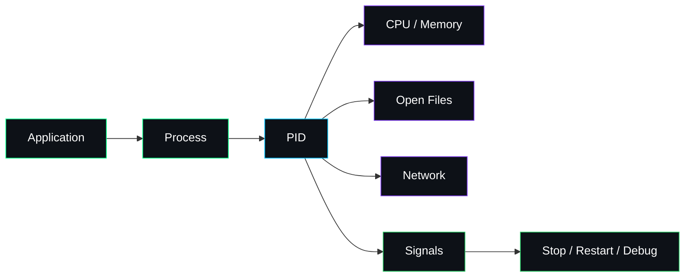
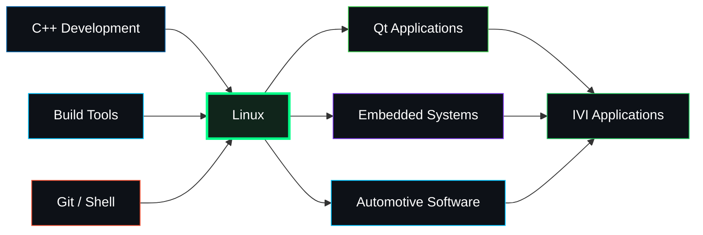

div align="center">


# 🐧 Linux Training Portfolio

### Command Line • System Fundamentals • Bash • Developer Workflow

<p>
  
  
  
  
</p>

<br/>


<br/><br/>

> **A hands-on Linux journey focused on understanding the operating environment, mastering the terminal, and building the system-level confidence required for embedded and automotive software development.**

</div>

---

## ✨ Overview

This folder is part of my **ITI training journey** and focuses on practical Linux usage from a software engineer's perspective.

Linux is more than an operating system in this learning path. It is the environment in which software is **built, executed, inspected, debugged, automated, and integrated**.

The training develops confidence in:

- navigating Linux efficiently,
- working with files and directories,
- understanding users and permissions,
- managing processes,
- using shell tools and pipelines,
- automating repetitive tasks,
- working with development tools,
- and preparing for **Embedded Linux, Qt, and Automotive IVI** projects.

<p align="center">
  <a href="https://github.com/mohamedabdelmajeed-eng/ITI">
    
  </a>
</p>

---

# 🧭 Linux Engineering Roadmap

```text
┌────────────────────────────────────────────────────────────────┐
│                     LINUX ENGINEERING PATH                     │
├────────────────────────────────────────────────────────────────┤
│                                                                │
│  Linux Fundamentals                                            │
│       │                                                        │
│       ▼                                                        │
│  Filesystem & Navigation                                       │
│       │                                                        │
│       ▼                                                        │
│  Users • Groups • Permissions                                  │
│       │                                                        │
│       ▼                                                        │
│  Processes • Services • Resources                              │
│       │                                                        │
│       ▼                                                        │
│  Shell Tools • Pipes • Redirection                             │
│       │                                                        │
│       ▼                                                        │
│  Bash Automation                                               │
│       │                                                        │
│       ▼                                                        │
│  Developer / Embedded / Automotive Workflow                    │
│                                                                │
└────────────────────────────────────────────────────────────────┘
```

---

# 🎯 Core Learning Areas

<table>
<tr>
<td width="50%" valign="top">

### 📂 Filesystem & Navigation

- Linux directory structure
- Absolute vs. relative paths
- File and directory operations
- Search and discovery
- Links
- Mounting concepts
- Disk usage awareness
- File inspection

</td>
<td width="50%" valign="top">

### 🔐 Users & Permissions

- Users and groups
- Ownership
- Read / write / execute permissions
- `chmod`
- `chown`
- Privilege concepts
- `sudo`
- Secure access thinking

</td>
</tr>

<tr>
<td width="50%" valign="top">

### ⚙️ Processes & System Control

- Process inspection
- Foreground / background jobs
- Signals
- Resource monitoring
- Service concepts
- Environment variables
- Exit status
- System troubleshooting

</td>
<td width="50%" valign="top">

### 💻 Shell & Automation

- Bash
- Pipes
- Redirection
- Command chaining
- Variables
- Conditions
- Loops
- Shell scripts

</td>
</tr>
</table>

> Individual exercises in this folder may focus on different subsets of these areas as the training evolves.

---

# 🖥️ Terminal Fundamentals

A Linux engineer spends less time memorizing commands and more time learning how to **combine small tools effectively**.

```bash
command input | process | filter | output
```

Example:

```bash
ps aux | grep application
```

or:

```bash
find . -name "*.cpp" | sort
```

The power of the Linux shell comes from composition:

```text
┌─────────┐    pipe     ┌─────────┐    pipe     ┌─────────┐
│ Command │ ──────────► │ Filter  │ ──────────► │ Output  │
└─────────┘             └─────────┘             └─────────┘
```

---

# 🧰 Essential Command Toolkit

| Category | Commands |
|---|---|
| **Navigation** | `pwd` `cd` `ls` |
| **Files** | `touch` `cp` `mv` `rm` `mkdir` |
| **Inspection** | `cat` `less` `head` `tail` `file` |
| **Search** | `find` `grep` `which` |
| **Permissions** | `chmod` `chown` `groups` |
| **Processes** | `ps` `top` `kill` `jobs` |
| **Storage** | `df` `du` `mount` |
| **Text Processing** | `grep` `sort` `uniq` `cut` `wc` |
| **Archives** | `tar` `gzip` |
| **Networking** | `ip` `ping` `ss` `curl` |
| **Development** | `gcc` `g++` `make` `cmake` `git` |

---

# 🔗 Pipes & Redirection

One of the most valuable Linux concepts is connecting commands together.

### Redirect output

```bash
command > output.txt
```

### Append output

```bash
command >> output.txt
```

### Redirect errors

```bash
command 2> error.log
```

### Pipe output to another command

```bash
cat file.txt | grep "error"
```

### Combine standard output and errors

```bash
command > build.log 2>&1
```

---

# 🔐 Linux Permissions

Linux permissions can be viewed as:

```text
        USER    GROUP   OTHER
        ───     ───     ───
        rwx     r-x     r--
```

Where:

| Permission | Meaning |
|---|---|
| `r` | Read |
| `w` | Write |
| `x` | Execute |

Example:

```bash
chmod 755 script.sh
```

Equivalent idea:

```text
Owner  → rwx
Group  → r-x
Other  → r-x
```

---

# ⚙️ Process Thinking

A useful troubleshooting flow:



Useful commands:

```bash
ps aux
top
pgrep application
kill <PID>
```

---

# 🧪 Bash Scripting

Bash turns repeated terminal actions into reusable workflows.

### Minimal example

```bash
#!/usr/bin/env bash

echo "Starting build..."

mkdir -p build
cd build || exit 1

cmake ..
cmake --build .

echo "Build completed."
```

Make it executable:

```bash
chmod +x build.sh
```

Run it:

```bash
./build.sh
```

---

# 🏗️ Linux Developer Workflow

```text
SOURCE CODE
    │
    ▼
┌──────────────┐
│   Editor     │
│ VS Code/Vim  │
└──────┬───────┘
       │
       ▼
┌──────────────┐
│ Build Tools  │
│ GCC / CMake  │
└──────┬───────┘
       │
       ▼
┌──────────────┐
│ Executable   │
└──────┬───────┘
       │
       ▼
┌──────────────┐
│ Linux Runtime│
└──────┬───────┘
       │
       ▼
┌──────────────┐
│ Debug / Logs │
└──────────────┘
```

---

# 🛠️ Development Stack

<p align="center">


</p>

---

# 🚀 Getting Started

Clone the full ITI repository:

```bash
git clone https://github.com/mohamedabdelmajeed-eng/ITI.git
```

Enter the repository:

```bash
cd ITI
```

Open the Linux training folder:

```bash
cd Linux
```

List the available material:

```bash
ls -la
```

Inspect the current working directory:

```bash
pwd
```

---

# 🧠 Engineering Skills Developed

This Linux training journey strengthens my ability to:

- ✅ Work confidently from the command line
- ✅ Navigate and understand the Linux filesystem
- ✅ Manage files and directories efficiently
- ✅ Understand ownership and permissions
- ✅ Inspect and control running processes
- ✅ Combine shell utilities using pipes
- ✅ Redirect and analyze command output
- ✅ Automate repetitive work with Bash
- ✅ Use Linux as a C/C++ development environment
- ✅ Debug software through processes, logs, and system state
- ✅ Use Git from the terminal
- ✅ Prepare for embedded and automotive Linux workflows

---

# 🐧 Linux as an Engineering Platform

Linux connects multiple areas of this ITI learning journey.



---

# 🚘 From Linux to Automotive IVI

Within the complete repository, the progression is:

<div align="center">

### ⚙️ C++ Programming

⬇

### 🐧 Linux Environment

⬇

### 🖥️ Qt GUI Development

⬇

### 🔗 System Integration

⬇

# 🎧 Sonique IVI Audio Player

**USB • Bluetooth • Automotive Infotainment**

</div>

<p align="center">

<a href="../C%2B%2B">
  
</a>

<a href="../QT">
  
</a>

</p>

<p align="center">
  <a href="../Grad_Project/Sonique_IVIAudioPlayer_USB_Bluetooth_Final">
    
  </a>
</p>

---

# 🔍 Troubleshooting Mindset

When something fails on Linux, investigate systematically:

```text
1. COMMAND
     │
     ▼
2. EXIT STATUS
     │
     ▼
3. PERMISSIONS
     │
     ▼
4. PATH / ENVIRONMENT
     │
     ▼
5. PROCESS STATE
     │
     ▼
6. LOGS / ERROR OUTPUT
     │
     ▼
7. DEPENDENCIES
     │
     ▼
8. ROOT CAUSE
```

Examples:

```bash
echo $?
which g++
env
ps aux
df -h
free -h
```

---

# ✅ Linux Practice Checklist

Before considering a Linux exercise complete:

- [ ] I understand what each command does
- [ ] I can explain the path being used
- [ ] Permissions are intentional
- [ ] Destructive commands are used carefully
- [ ] Errors are inspected instead of ignored
- [ ] Repeated steps are candidates for scripting
- [ ] Scripts have meaningful names
- [ ] Exit codes are considered
- [ ] Commands are documented when non-obvious
- [ ] The workflow can be reproduced

---

# 🧩 Terminal Productivity Tips

### Command history

```bash
history
```

### Search history

```text
Ctrl + R
```

### Autocomplete

```text
TAB
```

### Stop a foreground process

```text
Ctrl + C
```

### Clear terminal

```bash
clear
```

### Read command documentation

```bash
man <command>
```

Example:

```bash
man grep
```

---

# 🔭 Future Improvements

As this Linux folder grows, useful enhancements include:

- [ ] Add an index of every Linux exercise
- [ ] Add a Bash scripting section
- [ ] Add command examples beside each lab
- [ ] Add sample terminal output
- [ ] Add filesystem diagrams
- [ ] Add permissions exercises
- [ ] Add process-management labs
- [ ] Add networking fundamentals
- [ ] Add shell automation projects
- [ ] Add systemd/service examples
- [ ] Add debugging tools
- [ ] Add Linux + C++ build workflows
- [ ] Add embedded Linux notes where applicable

---

# 📚 Recommended Documentation Style

For every larger Linux exercise or script:

```text
Exercise / Script
│
├── Objective
├── Concepts Used
├── Commands
├── Implementation
├── Example Output
├── Troubleshooting
└── Key Learnings
```

This turns isolated terminal work into a **clear engineering portfolio**.

---

# 🤝 Feedback & Collaboration

Constructive technical feedback is always welcome.

If you see an opportunity to improve the work:

1. Open an **Issue**
2. Suggest a cleaner approach
3. Fork the repository
4. Submit a Pull Request

---

## 👨‍💻 Maintainer

<div align="center">

### @mohamedabdelmajeed-eng

**C++ • Linux • Qt • Embedded • Automotive Software**

<a href="https://github.com/mohamedabdelmajeed-eng">
  
</a>

<br/><br/>

⭐ **If you find this learning journey useful, consider starring the main ITI repository.**

</div>

---

<div align="center">

### 🐧 Master the terminal. Understand the system. Engineer with confidence.


</div>
