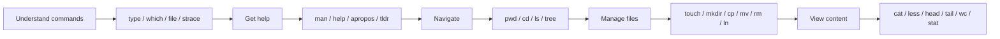

# Linux Commands Summary — Sections 0 to 6

> A professional quick-reference table for the commands introduced in the first seven sections of the Linux handbook.
>
> **Covered sections:**
> 0. How You Actually Talk to Linux  
> 1. Anatomy of a Command  
> 2. Getting Help  
> 3. Filesystem Hierarchy  
> 4. Navigation  
> 5. Creating, Copying, Moving, and Deleting  
> 6. Viewing File Contents

---

## 0. How You Actually Talk to Linux

| Command | Purpose | Simple Example | What the Example Does |
|---|---|---|---|
| `type` | Shows how the shell interprets a command: alias, builtin, function, or executable. | `type ls` | Shows whether `ls` is an alias or program. |
| `type -a` | Shows every available version of a command in search order. | `type -a ls` | Displays the alias and executable path for `ls`. |
| `which` | Shows the executable that would run from `$PATH`. | `which ls` | Usually prints `/usr/bin/ls`. |
| `file` | Identifies the real type of a file by inspecting its contents. | `file /usr/bin/ls` | Identifies `ls` as an executable binary. |
| `strace` | Displays the system calls a program makes to the Linux kernel. | `strace -c ls /etc` | Summarizes the kernel requests made by `ls`. |
| `cat` | Prints file contents to the terminal. | `cat /proc/cpuinfo` | Displays CPU information exposed by the kernel. |
| `echo` | Prints text or shell-expanded values. | `echo $$` | Prints the current shell process ID. |
| `tee` | Reads standard input and writes it to a file and the screen. | `echo 1 \| sudo tee /proc/sys/net/ipv4/ip_forward` | Writes a kernel setting with administrator privileges. |
| `sudo` | Runs a command with administrator privileges. | `sudo apt install strace -y` | Installs `strace` as root. |
| `apt install` | Installs software packages on Ubuntu/Debian systems. | `sudo apt install strace -y` | Installs the `strace` package automatically. |
| `ls` | Lists files and directories. | `ls /proc/$$/` | Lists information about the current shell process. |

---

## 1. Anatomy of a Command

| Syntax / Operator | Purpose | Simple Example | What the Example Does |
|---|---|---|---|
| `command` | The program or shell builtin you want to run. | `ls` | Runs the `ls` command. |
| `-x` | A short option, usually one letter after one dash. | `ls -l` | Uses long-listing format. |
| `--long-option` | A readable long option after two dashes. | `ls --human-readable` | Displays sizes in an easier format. |
| Bundled options | Combines several short options after one dash. | `ls -lah` | Same as `ls -l -a -h`. |
| `--` | Marks the end of options. Useful for filenames beginning with `-`. | `rm -- -weirdfile` | Deletes a file named `-weirdfile`. |
| `$?` | Expands to the exit status of the previous command. | `echo $?` | Prints `0` for success or another number for failure. |
| `&&` | Runs the next command only when the previous one succeeds. | `mkdir project && cd project` | Enters the directory only if it was created. |
| `||` | Runs the next command only when the previous one fails. | `ping -c1 8.8.8.8 || echo "No network"` | Prints a warning if the ping fails. |
| `;` | Runs commands one after another regardless of success or failure. | `command1 ; command2` | Always attempts both commands. |
| `grep` | Searches input for matching text. | `grep "root" /etc/passwd` | Searches for lines containing `root`. |

---

## 2. Getting Help

| Command | Purpose | Simple Example | What the Example Does |
|---|---|---|---|
| `man` | Opens the full manual page for a command. | `man ls` | Opens the manual for `ls`. |
| `man <section> <name>` | Opens a specific manual section. | `man 5 passwd` | Opens the documentation for the `/etc/passwd` file format. |
| `--help` | Displays a quick command summary and common options. | `cp --help` | Shows help for `cp`. |
| `apropos` | Searches manual-page descriptions by keyword. | `apropos partition` | Finds commands related to partitions. |
| `man -k` | Performs the same keyword search as `apropos`. | `man -k compress` | Finds commands related to compression. |
| `mandb` | Creates or refreshes the manual-page search database. | `sudo mandb` | Rebuilds the database used by `apropos`. |
| `whatis` | Displays a one-line description of a command or topic. | `whatis ls` | Shows a short description of `ls`. |
| `info` | Opens detailed GNU documentation. | `info bash` | Opens the GNU Bash manual. |
| `type` | Shows whether a command is an alias, builtin, function, or file. | `type cd` | Shows that `cd` is a shell builtin. |
| `which` | Shows the first matching executable in `$PATH`. | `which grep` | Usually prints `/usr/bin/grep`. |
| `whereis` | Finds a command's binary, source, and manual locations. | `whereis grep` | Displays known locations for `grep`. |
| `command -v` | Portably shows how the shell resolves a command. | `command -v ls` | Shows the command that the shell will run. |
| `help` | Displays help for Bash builtins. | `help cd` | Shows help for the builtin `cd` command. |
| `tldr` | Shows short, practical, community-written examples. | `tldr find` | Displays common examples for `find`. |
| `zless` | Opens a compressed text file in a pager. | `zless /usr/share/doc/bash/README.gz` | Reads compressed Bash documentation without extracting it. |
| `head` | Displays the beginning of input. | `ls --help \| head -20` | Shows only the first 20 help lines. |
| `grep -A` | Shows matching lines plus lines after each match. | `cp --help \| grep -A2 recursive` | Finds the recursive option and two following lines. |

---

## 3. Filesystem Hierarchy

| Command / Symbol | Purpose | Simple Example | What the Example Does |
|---|---|---|---|
| `ls /` | Lists the top-level Linux directories. | `ls /` | Shows directories such as `/etc`, `/home`, and `/var`. |
| `man 7 hier` | Opens the official filesystem hierarchy documentation. | `man 7 hier` | Explains the purpose of standard Linux directories. |
| `ls -l` | Shows detailed file information. | `ls -l /bin` | Reveals whether `/bin` is a symbolic link. |
| `df -h` | Shows mounted filesystems and disk usage in readable units. | `df -h` | Displays free and used storage space. |
| `file` | Detects a file's real content type. | `file /etc/passwd` | Identifies `/etc/passwd` as text. |
| `/` | Represents the root of the entire filesystem tree. | `cd /` | Moves to the filesystem root. |
| `.` | Represents the current directory. | `./script.sh` | Runs `script.sh` from the current directory. |
| `..` | Represents the parent directory. | `cd ..` | Moves up one directory level. |
| `~` | Represents the current user's home directory. | `cd ~` | Moves to your home directory. |
| `~user` | Represents another user's home directory. | `ls ~root` | Lists the root user's home directory if permitted. |
| `-` | Represents the previous directory when used with `cd`. | `cd -` | Returns to the previous directory. |

---

## 4. Navigation

| Command | Purpose | Simple Example | What the Example Does |
|---|---|---|---|
| `pwd` | Prints the current working directory. | `pwd` | Shows your current location. |
| `pwd -P` | Prints the physical path after resolving symbolic links. | `pwd -P` | Shows the real directory path. |
| `pwd -L` | Prints the logical path and preserves symbolic-link names. | `pwd -L` | Shows the path as you navigated it. |
| `cd` | Changes the current directory. | `cd /var/log` | Moves into `/var/log`. |
| `cd ..` | Moves to the parent directory. | `cd ..` | Goes up one level. |
| `cd ../..` | Moves up two directory levels. | `cd ../..` | Goes up two levels. |
| `cd` or `cd ~` | Moves to the current user's home directory. | `cd ~` | Returns home. |
| `cd -` | Switches to the previous directory. | `cd -` | Toggles between two locations. |
| `ls` | Lists directory contents. | `ls` | Shows visible files and folders. |
| `ls -l` | Uses detailed long-listing format. | `ls -l` | Shows permissions, owner, size, and date. |
| `ls -a` | Shows all entries, including hidden files. | `ls -a` | Includes files beginning with `.`. |
| `ls -A` | Shows hidden entries except `.` and `..`. | `ls -A` | Produces a cleaner hidden-file listing. |
| `ls -h` | Displays human-readable sizes when combined with `-l`. | `ls -lh` | Shows sizes such as `4.0K` or `2.1M`. |
| `ls -t` | Sorts by modification time, newest first. | `ls -lt` | Shows recently modified files first. |
| `ls -r` | Reverses the selected sort order. | `ls -ltr` | Shows oldest entries first. |
| `ls -S` | Sorts by file size. | `ls -lS` | Shows the largest files first. |
| `ls -R` | Lists directories recursively. | `ls -R /etc/apt` | Shows the entire directory tree below `/etc/apt`. |
| `ls -d` | Shows information about a directory itself. | `ls -ld /etc` | Displays metadata for `/etc`, not its contents. |
| `ls -i` | Displays inode numbers. | `ls -li` | Shows each item's inode. |
| `ls -1` | Displays one entry per line. | `ls -1` | Creates a simple vertical list. |
| `ls -F` | Appends symbols indicating file type. | `ls -F` | Adds `/` to directories and `@` to symlinks. |
| `tree` | Displays folders and files as a visual tree. | `tree -L 2 /var` | Shows two directory levels below `/var`. |
| `*` | Matches any number of characters. | `ls *.txt` | Lists all `.txt` files. |
| `?` | Matches exactly one character. | `ls file?.txt` | Matches names such as `file1.txt`. |
| `[abc]` | Matches one character from a set. | `ls file[123].txt` | Matches `file1.txt`, `file2.txt`, or `file3.txt`. |
| `[1-5]` | Matches one character from a range. | `ls file[1-5].txt` | Matches files numbered 1 through 5. |
| `[!1]` | Matches one character not in the set. | `ls file[!1].txt` | Excludes names with `1` in that position. |
| `{a,b}` | Expands alternatives before the command runs. | `ls *.{txt,log}` | Lists both `.txt` and `.log` files. |
| `{1..5}` | Expands a sequence. | `touch file{1..5}.txt` | Creates five numbered filenames. |

---

## 5. Creating, Copying, Moving, and Deleting

| Command | Purpose | Simple Example | What the Example Does |
|---|---|---|---|
| `touch` | Creates an empty file or updates file timestamps. | `touch notes.txt` | Creates `notes.txt` if it does not exist. |
| `touch -c` | Updates timestamps without creating a missing file. | `touch -c notes.txt` | Changes the time only when the file already exists. |
| `touch -t` | Sets a specific timestamp. | `touch -t 202601011200 file.txt` | Sets the timestamp to the given date and time. |
| `touch -d` | Sets a timestamp using readable date text. | `touch -d "2 days ago" file.txt` | Sets the file time to two days earlier. |
| `touch -r` | Copies timestamps from another file. | `touch -r source.txt target.txt` | Gives the target the same timestamps as the source. |
| `touch -a` | Changes only the access time. | `touch -a file.txt` | Updates atime only. |
| `touch -m` | Changes only the modification time. | `touch -m file.txt` | Updates mtime only. |
| `mkdir` | Creates directories. | `mkdir projects` | Creates a directory named `projects`. |
| `mkdir -p` | Creates parent directories as needed. | `mkdir -p a/b/c` | Creates the full directory path safely. |
| `mkdir -m` | Sets permissions during creation. | `mkdir -m 750 secure_dir` | Creates a directory with mode `750`. |
| `mkdir -v` | Prints each created directory. | `mkdir -pv a/b/c` | Creates the path and reports each step. |
| `cp` | Copies files. | `cp file.txt backup.txt` | Creates a copy named `backup.txt`. |
| `cp -r` | Copies directories recursively. | `cp -r project /tmp/` | Copies the directory and everything inside it. |
| `cp -i` | Prompts before overwriting. | `cp -i file.txt /tmp/` | Asks before replacing an existing file. |
| `cp -n` | Prevents overwriting existing files. | `cp -n file.txt /tmp/` | Skips the copy if the destination exists. |
| `cp -v` | Displays copied paths. | `cp -v file.txt /tmp/` | Shows what was copied. |
| `cp -p` | Preserves permissions, ownership, and timestamps. | `cp -p file.txt backup.txt` | Copies while keeping metadata. |
| `cp -a` | Performs an archive-style copy preserving almost everything. | `cp -av /etc/apt /tmp/apt-backup` | Creates a detailed configuration backup. |
| `cp -u` | Copies only when the source is newer or destination is missing. | `cp -u src/* dest/` | Updates older destination files. |
| `cp -l` | Creates hard links instead of normal copies. | `cp -l file.txt hardcopy.txt` | Creates another name for the same inode. |
| `cp -s` | Creates symbolic links instead of normal copies. | `cp -s file.txt softcopy.txt` | Creates a symlink to the source. |
| `mv` | Moves or renames files and directories. | `mv old.txt new.txt` | Renames the file. |
| `mv -i` | Prompts before overwriting. | `mv -i a.txt b.txt` | Asks before replacing `b.txt`. |
| `mv -n` | Never overwrites an existing destination. | `mv -n a.txt b.txt` | Leaves `b.txt` unchanged if it exists. |
| `mv -v` | Displays moved paths. | `mv -v *.log archive/` | Shows each file being moved. |
| `mv -b` | Backs up an existing destination before overwriting it. | `mv -b a.txt b.txt` | Keeps the old `b.txt` as `b.txt~`. |
| `rm` | Permanently deletes files. | `rm file.txt` | Deletes `file.txt` without using a trash bin. |
| `rm -r` | Deletes directories recursively. | `rm -r old_project/` | Deletes the directory and everything inside it. |
| `rm -f` | Forces deletion and suppresses prompts. | `rm -f file.txt` | Removes the file without asking. |
| `rm -i` | Prompts before every deletion. | `rm -i file.txt` | Requests confirmation. |
| `rm -I` | Prompts once before a large or recursive deletion. | `rm -I *.log` | Gives one safety confirmation for the batch. |
| `rm -v` | Displays deleted paths. | `rm -v file.txt` | Shows what was removed. |
| `rm -d` | Removes an empty directory. | `rm -d emptydir` | Deletes an empty folder. |
| `rmdir` | Removes empty directories only. | `rmdir emptydir` | Fails safely if the directory contains files. |
| `rmdir -p` | Removes empty parent directories in sequence. | `rmdir -p a/b/c` | Removes `c`, then `b`, then `a` if each is empty. |
| `ln` | Creates a hard link. | `ln original.txt hardlink.txt` | Creates another filename for the same inode. |
| `ln -s` | Creates a symbolic link. | `ln -s /path/to/original shortcut` | Creates a path-based shortcut. |
| `ln -f` | Replaces an existing destination link or file. | `ln -sf /new/target shortcut` | Forces the symbolic link to point to a new target. |

> [!CAUTION]
> `rm` permanently removes data. Check the path with `ls` before using `rm -r` or `rm -rf`.

---

## 6. Viewing File Contents

| Command | Purpose | Simple Example | What the Example Does |
|---|---|---|---|
| `cat` | Prints one or more files and can concatenate them. | `cat file.txt` | Displays the whole file. |
| `cat -n` | Numbers all output lines. | `cat -n file.txt` | Shows line numbers, including blank lines. |
| `cat -b` | Numbers only nonblank lines. | `cat -b file.txt` | Skips numbering empty lines. |
| `cat -A` | Shows hidden characters such as tabs and line endings. | `cat -A script.sh` | Helps detect invisible formatting problems. |
| `cat -s` | Collapses repeated blank lines. | `cat -s file.txt` | Makes large blank areas smaller. |
| `less` | Opens a large file in a scrollable pager. | `less /var/log/syslog` | Lets you search and move through the file. |
| `less +F` | Follows a growing file in real time. | `less +F /var/log/syslog` | Watches new log entries. |
| `less -N` | Shows line numbers. | `less -N file.txt` | Displays numbered lines in the pager. |
| `less -S` | Prevents long lines from wrapping. | `less -S file.txt` | Lets you scroll horizontally. |
| `head` | Displays the first 10 lines by default. | `head file.txt` | Shows the beginning of the file. |
| `head -n` | Displays a selected number of first lines. | `head -n 20 file.txt` | Shows the first 20 lines. |
| `head -c` | Displays a selected number of bytes. | `head -c 100 file.txt` | Shows the first 100 bytes. |
| `tail` | Displays the last 10 lines by default. | `tail file.txt` | Shows the end of the file. |
| `tail -n` | Displays a selected number of last lines. | `tail -n 50 /var/log/syslog` | Shows the last 50 log lines. |
| `tail -f` | Continuously follows appended file content. | `tail -f /var/log/syslog` | Watches a log update live. |
| `tail -F` | Follows a file and survives log rotation. | `tail -F /var/log/syslog` | Keeps watching even if the log file is replaced. |
| `wc` | Counts lines, words, and bytes. | `wc file.txt` | Prints all basic counts. |
| `wc -l` | Counts lines. | `wc -l file.txt` | Prints the number of lines. |
| `wc -w` | Counts words. | `wc -w file.txt` | Prints the number of words. |
| `wc -c` | Counts bytes. | `wc -c file.txt` | Prints the file size in bytes. |
| `wc -m` | Counts characters. | `wc -m file.txt` | Correctly counts multibyte characters. |
| `wc -L` | Prints the length of the longest line. | `wc -L file.txt` | Finds the widest line. |
| `file` | Identifies content type. | `file photo.jpg` | Reports the real file format. |
| `file -b` | Hides the filename and shows only the type. | `file -b photo.jpg` | Prints a brief type description. |
| `file -i` | Shows the MIME type. | `file -i document.txt` | Prints a MIME value such as `text/plain`. |
| `stat` | Displays detailed file metadata. | `stat file.txt` | Shows size, permissions, inode, and timestamps. |
| `stat -c` | Prints selected metadata in a custom format. | `stat -c '%U %G %a %n' file.txt` | Prints owner, group, permissions, and name. |
| `stat -f` | Displays filesystem information instead of file information. | `stat -f /` | Shows details about the root filesystem. |
| `nl` | Numbers lines with more control than `cat -n`. | `nl file.txt` | Displays a numbered version of the file. |
| `tac` | Prints lines in reverse order. | `tac file.txt` | Displays the last line first. |
| `rev` | Reverses the characters in each line. | `rev file.txt` | Mirrors each line's text. |
| `od -c` | Displays data as characters and octal values. | `od -c file.bin` | Inspects low-level file bytes. |
| `xxd` | Creates a hexadecimal dump. | `xxd file.bin \| head` | Shows the first lines of a hex view. |
| `strings` | Extracts printable text from binary files. | `strings /usr/bin/ls` | Shows readable strings inside the executable. |
| `zcat` | Prints a gzip-compressed file without extracting it. | `zcat file.gz` | Displays compressed text directly. |
| `zless` | Opens compressed text in `less`. | `zless file.gz` | Scrolls through a gzip file. |
| `zgrep` | Searches inside gzip-compressed text. | `zgrep "error" app.log.gz` | Finds matching text without extracting the file. |

---

## Quick Command Map



---

## Essential Safety Rules

1. Use `pwd` before changing or deleting important files.
2. Use `ls` to inspect a path before running `rm -r`.
3. Prefer `rm -I`, `cp -i`, and `mv -i` while learning.
4. Use `man command` or `command --help` before trying an unfamiliar option.
5. Remember that Linux filenames and options are case-sensitive.

---

## One-Line Cheat Sheet

```bash
# Identify a command
type -a command
which command

# Get help
man command
command --help
apropos "task description"

# Navigate
pwd
cd /path
ls -lah

# Create and manage
touch file.txt
mkdir -p project/src
cp -a source backup
mv old new
rm -I file
ln -s target shortcut

# Read and inspect
cat small.txt
less large.log
head -n 20 file.txt
tail -f app.log
wc -l file.txt
file unknown_file
stat file.txt
```
