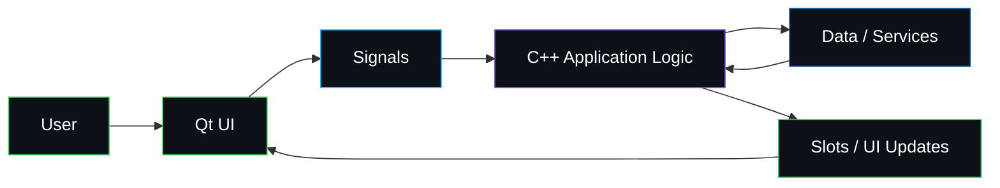

<div align="center">


# 🖥️ Qt / C++ Training Portfolio

### From C++ Logic to Professional Graphical User Interfaces

<p>
  
  
  
  
</p>

<br/>


<br/><br/>

> **A practical Qt learning journey focused on transforming C++ knowledge into interactive, maintainable, event-driven graphical applications.**

</div>

---

## ✨ Overview

This folder is part of my **ITI training journey** and focuses on practical application development using **Qt and C++**.

The purpose of this section is to move beyond console-based programming and build a stronger understanding of:

- event-driven software,
- graphical user interface design,
- signal/slot communication,
- application structure,
- reusable UI components,
- resource handling,
- and professional desktop / embedded application workflows.

The Qt training also creates an important bridge between **core C++ programming** and larger **embedded / automotive user-interface projects**.

<p align="center">
  <a href="https://github.com/mohamedabdelmajeed-eng/ITI">
    
  </a>
</p>

---

# 🧭 Qt Learning Roadmap

```text
┌────────────────────────────────────────────────────────────────┐
│                      QT DEVELOPMENT PATH                       │
├────────────────────────────────────────────────────────────────┤
│                                                                │
│  C++ Foundations                                               │
│       │                                                        │
│       ▼                                                        │
│  Qt Application Structure                                     │
│       │                                                        │
│       ▼                                                        │
│  Widgets / UI Components                                      │
│       │                                                        │
│       ▼                                                        │
│  Signals & Slots                                              │
│       │                                                        │
│       ▼                                                        │
│  Layouts • Events • Resources                                 │
│       │                                                        │
│       ▼                                                        │
│  Multi-Window / Modular Applications                          │
│       │                                                        │
│       ▼                                                        │
│  Automotive / IVI User Interfaces                             │
│                                                                │
└────────────────────────────────────────────────────────────────┘
```

---

# 🎯 Core Learning Areas

<table>
<tr>
<td width="50%" valign="top">

### 🟢 Qt Fundamentals

- Qt project structure
- Application lifecycle
- `QApplication`
- Main windows
- Dialogs
- Widgets
- Object hierarchy
- Parent-child ownership

</td>
<td width="50%" valign="top">

### 🔗 Signals & Slots

- Event-driven communication
- Connecting UI actions to logic
- Built-in signals
- Custom slots
- Lambda connections
- Component decoupling
- Reactive application behavior

</td>
</tr>

<tr>
<td width="50%" valign="top">

### 🎨 GUI Development

- Buttons
- Labels
- Input fields
- Menus
- Toolbars
- Layout managers
- Forms
- Styling concepts

</td>
<td width="50%" valign="top">

### 🧩 Application Architecture

- UI / logic separation
- Header and source organization
- Reusable components
- Resource files
- Modular design
- Maintainability
- Debugging workflow

</td>
</tr>
</table>

> Individual exercises in this folder may focus on different combinations of these concepts as the training progresses.

---

# ⚡ Signals & Slots — The Core Idea

Qt applications are fundamentally **event-driven**.

Instead of continuously checking whether something happened, components can communicate through signals and slots.

```cpp
connect(
    ui->pushButton,
    &QPushButton::clicked,
    this,
    &MainWindow::handleButtonClick
);
```

Conceptually:

```text
 USER ACTION
     │
     ▼
┌─────────────┐
│   Widget    │
└──────┬──────┘
       │ Signal
       ▼
┌─────────────┐
│ Application │
│    Logic    │
└──────┬──────┘
       │
       ▼
┌─────────────┐
│  UI Update  │
└─────────────┘
```

This pattern helps create responsive applications while keeping interface behavior organized.

---

# 🏗️ Typical Qt Application Architecture



---

# 🛠️ Technology Stack

<div align="center">

| Technology | Purpose |
|---|---|
| **Qt** | Application and GUI framework |
| **C++** | Core application logic |
| **Qt Widgets / UI** | User-interface construction |
| **Signals & Slots** | Event-driven communication |
| **CMake / qmake** | Project configuration and build workflow |
| **Linux** | Development environment |
| **Git** | Version control |
| **GitHub** | Project hosting and documentation |

</div>

---

# 💻 Development Environment

<p align="center">


</p>

---

# 📁 Recommended Qt Project Structure

```text
QtProject/
│
├── CMakeLists.txt
│
├── main.cpp
│
├── mainwindow.h
├── mainwindow.cpp
├── mainwindow.ui
│
├── resources/
│   ├── icons/
│   └── images/
│
└── README.md
```

For larger applications:

```text
QtProject/
│
├── CMakeLists.txt
│
├── include/
│   ├── ui/
│   ├── controllers/
│   └── services/
│
├── src/
│   ├── main.cpp
│   ├── ui/
│   ├── controllers/
│   └── services/
│
├── resources/
│   ├── icons/
│   ├── images/
│   └── resources.qrc
│
└── README.md
```

---

# 🚀 Build & Run

## Using Qt Creator

```text
1. Open the project in Qt Creator
2. Select the correct Kit
3. Configure the project
4. Build
5. Run
```

---

## Using CMake

A typical Qt 6 CMake workflow:

```bash
cmake -S . -B build
cmake --build build
./build/<application_name>
```

A minimal Qt 6 configuration can look like:

```cmake
cmake_minimum_required(VERSION 3.16)

project(MyQtApp LANGUAGES CXX)

set(CMAKE_CXX_STANDARD 17)
set(CMAKE_CXX_STANDARD_REQUIRED ON)

find_package(Qt6 REQUIRED COMPONENTS Widgets)

qt_standard_project_setup()

qt_add_executable(MyQtApp
    main.cpp
    mainwindow.cpp
    mainwindow.h
    mainwindow.ui
)

target_link_libraries(MyQtApp PRIVATE Qt6::Widgets)
```

> Build configuration can vary between exercises depending on the Qt version and project type.

---

# 🎨 UI Engineering Principles

A strong Qt application should not only work — it should also remain understandable and maintainable.

### Visual Layer

```text
Typography
    +
Spacing
    +
Hierarchy
    +
Consistency
    +
Feedback
    =
Better User Experience
```

### Code Layer

```text
Small Components
      +
Clear Responsibilities
      +
Signal / Slot Communication
      +
Reusable Logic
      +
Consistent Naming
      =
Maintainable Qt Application
```

---

# 🧠 Engineering Skills Developed

Through this Qt training journey, I am strengthening my ability to:

- ✅ Build graphical applications with C++
- ✅ Understand event-driven programming
- ✅ Design responsive user interactions
- ✅ Use Qt signals and slots effectively
- ✅ Structure UI and application logic
- ✅ Manage widget relationships and ownership
- ✅ Organize medium-sized C++ projects
- ✅ Work with UI resources and assets
- ✅ Debug interface and logic problems
- ✅ Build a foundation for embedded GUI systems
- ✅ Prepare for automotive infotainment development

---

# 🚘 From Qt Training to Automotive IVI

Qt is especially valuable in projects that require rich graphical interfaces while maintaining strong C++ integration.

Within my complete ITI journey, the progression is:

<div align="center">

### ⚙️ C++

⬇

### 🐧 Linux

⬇

### 🖥️ Qt

⬇

### 🔗 System Integration

⬇

# 🚘 Sonique IVI Audio Player

**USB • Bluetooth • Automotive Infotainment**

</div>

<p align="center">
  <a href="../Grad_Project/Sonique_IVIAudioPlayer_USB_Bluetooth_Final">
    
  </a>
</p>

---

# 🎧 Qt in the Sonique Journey

The Qt training establishes several important concepts that later become useful in an IVI application:

<table>
<tr>
<td width="33%" align="center">

### 🎨 Interface

Building clean and interactive graphical experiences.

</td>
<td width="33%" align="center">

### 🔗 Interaction

Connecting user actions to application behavior.

</td>
<td width="33%" align="center">

### ⚙️ Logic

Integrating C++ application logic with the interface.

</td>
</tr>

<tr>
<td width="33%" align="center">

### 🎵 Media UI

Designing controls suitable for media applications.

</td>
<td width="33%" align="center">

### 🧩 Components

Building reusable and maintainable interface modules.

</td>
<td width="33%" align="center">

### 🚘 IVI Thinking

Applying GUI engineering to automotive use cases.

</td>
</tr>
</table>

---

# 🧪 Example Qt Workflow

```bash
# Clone the complete ITI repository
git clone https://github.com/mohamedabdelmajeed-eng/ITI.git

# Enter the repository
cd ITI

# Open the Qt training folder
cd QT

# Open your selected project
cd <project-folder>

# Configure
cmake -S . -B build

# Build
cmake --build build

# Run
./build/<application_name>
```

---

# 🔍 Debugging Mindset

When debugging a Qt application, check the system in layers:

```text
┌───────────────────────────┐
│ 1. Build / Compiler       │
├───────────────────────────┤
│ 2. Object Construction    │
├───────────────────────────┤
│ 3. Signal Connections     │
├───────────────────────────┤
│ 4. Event Handling         │
├───────────────────────────┤
│ 5. Business Logic         │
├───────────────────────────┤
│ 6. UI State Update        │
└───────────────────────────┘
```

Useful questions include:

- Is the object created?
- Is the signal emitted?
- Is the slot connected?
- Does the slot execute?
- Is the application state correct?
- Is the UI being updated from the correct state?

---

# ✅ Qt Code Quality Checklist

Before considering a Qt exercise complete:

- [ ] Project builds without unexpected warnings
- [ ] UI naming is clear and consistent
- [ ] Signal / slot connections are understandable
- [ ] UI logic is not unnecessarily duplicated
- [ ] Business logic is separated where practical
- [ ] Ownership and object lifetime are understood
- [ ] Layouts are used instead of fragile fixed positioning
- [ ] Resources are organized
- [ ] Error cases are handled
- [ ] Code formatting is consistent
- [ ] The interface remains readable and usable

---

# 📈 Training Evolution


---

# 🔭 Future Improvements

As this folder grows, the documentation can evolve with it:

- [ ] Add a visual project index
- [ ] Add screenshots for each GUI exercise
- [ ] Add animated GIF demos
- [ ] Document Qt Widgets exercises individually
- [ ] Add Qt Quick / QML projects where applicable
- [ ] Add reusable component examples
- [ ] Add application architecture diagrams
- [ ] Add unit-testing examples
- [ ] Add CMake presets
- [ ] Add CI build validation
- [ ] Add performance / responsiveness notes
- [ ] Add automotive UI design examples

---

# 📸 Recommended Project Presentation

For every significant Qt project, document it using this structure:

```text
Project Name
│
├── Screenshot / GIF
├── Objective
├── Features
├── Technologies
├── Architecture
├── Build Instructions
├── Challenges
└── Key Learnings
```

That turns a training exercise into a **professional portfolio project**.

---

# 🤝 Feedback & Collaboration

Constructive feedback is always welcome.

If you find an opportunity to improve an implementation:

1. Open an **Issue**
2. Suggest an enhancement
3. Fork the repository
4. Submit a Pull Request

---

## 👨‍💻 Maintainer

<div align="center">

### @mohamedabdelmajeed-eng

**C++ • Linux • Qt • Embedded • Automotive Software**

<a href="https://github.com/mohamedabdelmajeed-eng">
  
</a>

<br/><br/>

⭐ **If you find this journey useful, consider starring the main ITI repository.**

</div>

---

<div align="center">

### 🖥️ Build the interface. Connect the logic. Engineer the experience.


</div>
