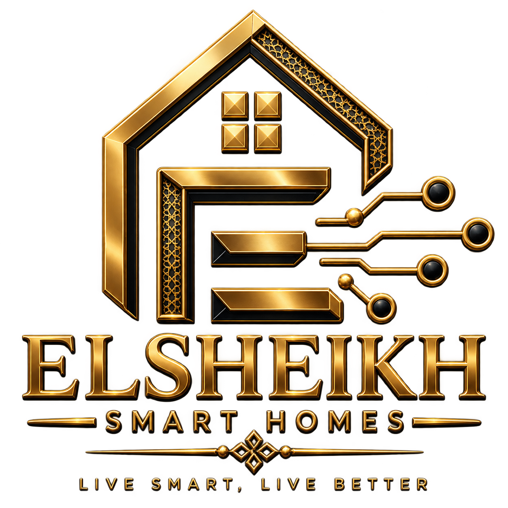
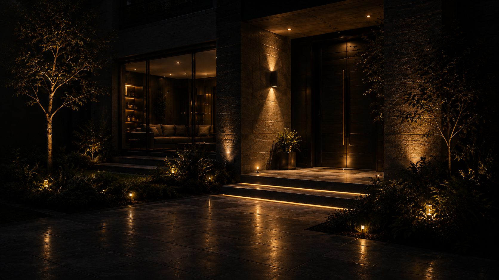
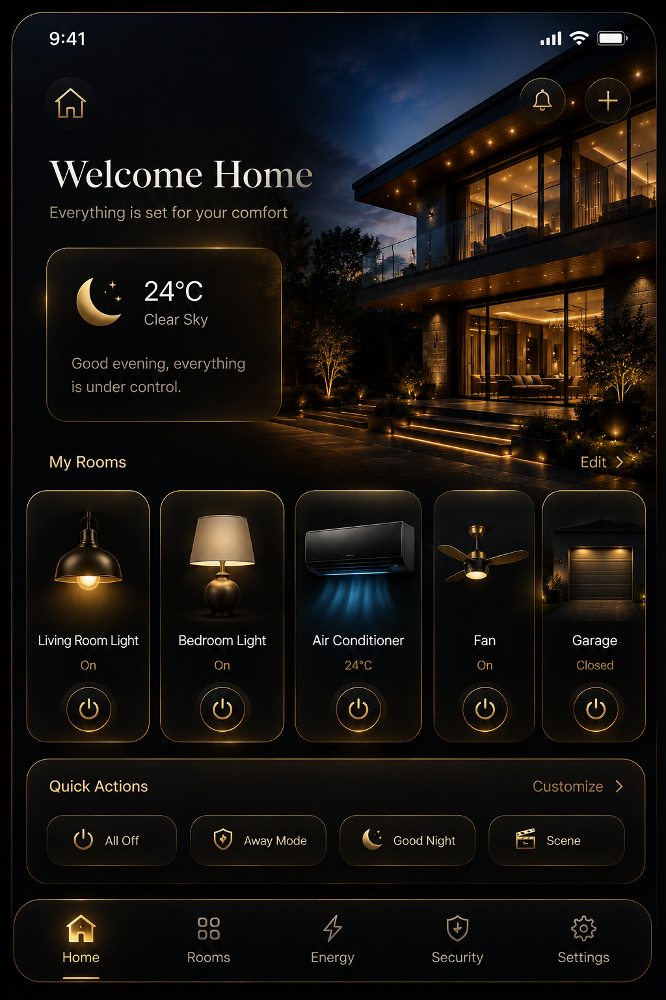

<!-- ========================================================= -->
<!--            ELSHEIKH SMART HOMES — README                  -->
<!-- ========================================================= -->

<div align="center">



# ELSHEIKH SMART HOMES

### Intelligent Living • Premium Control • Modern Comfort

<br>


<br>

> **A premium bilingual Smart Home desktop application built with Qt 6, QML, Qt Quick, C++ and Qt Linguist.**

</div>

---

## ✦ Overview

**Elsheikh Smart Homes** is a modern Smart Home control interface designed to provide a clean, elegant and intuitive experience for managing home devices.

The project combines a **luxury dark-and-gold visual identity** with a modular QML architecture.

Users can log in, view their Smart Home dashboard, control individual devices, execute quick actions, adjust home preferences and switch the complete interface between **English and Arabic**.

The project was developed using:

- **Qt 6**
- **Qt Quick**
- **QML**
- **C++17**
- **CMake**
- **Qt Linguist / LinguistTools**

---

# ✦ Application Preview

<div align="center">



### Premium Smart Home Experience

*Designed around a sophisticated dark interface with warm gold accents.*

</div>

---

# ✦ Core Features

<table>
<tr>

<td width="50%" valign="top">

### 🔐 Premium Login

A professionally designed login interface provides the entry point to the Smart Home system.

**Features**

- Responsive premium layout
- Username input
- Password input
- Remember Me option
- Forgot Password action
- Sign-in button
- Fingerprint sign-in interface
- Loading indicator
- Input validation
- Smart Home branding
- Responsive logo placement

</td>

<td width="50%" valign="top">

### 🏠 Smart Dashboard

The dashboard provides centralized access to the home's connected devices.

**Devices**

- 💡 Living Room Light
- 💡 Bedroom Light
- ❄️ Air Conditioner
- 🌀 Fan
- 🚪 Garage Door

Each device is presented through a reusable Smart Home device card.

</td>

</tr>
</table>

---

# ✦ Dashboard

<div align="center">



</div>

The dashboard acts as the **central control center** of the application.

It combines:

- Smart Home status
- Device management
- Quick actions
- Navigation
- Premium visual hierarchy
- Responsive layout
- Device state controls

The design keeps unnecessary information to a minimum while giving the most important Smart Home controls immediate visibility.

---

# ✦ Smart Device Control

The application currently includes five primary Smart Home devices.

| Device | Function |
|:---|:---|
| 💡 **Living Room Light** | Control living-room lighting |
| 💡 **Bedroom Light** | Control bedroom lighting |
| ❄️ **Air Conditioner** | Manage cooling |
| 🌀 **Fan** | Control room ventilation |
| 🚪 **Garage Door** | Manage garage access |

Device interfaces are built around the reusable:

```text
DeviceCard.qml
```

This avoids duplicating the same UI structure for every Smart Home device.

---

# ✦ Quick Actions

The dashboard also provides dedicated **Quick Actions** for common Smart Home scenarios.

### ◇ ALL OFF

Turns the home's active devices off through one centralized action.

### ◇ COMFORT MODE

Provides a convenient action for configuring the home around comfort.

### ◇ GOOD NIGHT

Provides a nighttime Smart Home action for preparing the home for sleep.

The interface is implemented in:

```text
QuickActions.qml
```

This keeps dashboard actions separated from the main dashboard implementation.

---

# ✦ Premium Settings Center

The application includes a complete Settings interface with dedicated control cards.

<table>
<tr>

<td width="50%" valign="top">

### 🌐 Language

Switch the application between:

**English**

and

**العربية**

The default application language is **English**.

</td>

<td width="50%" valign="top">

### ☀️ Screen Brightness

A custom slider provides simulated screen brightness control.

Range:

```text
0% ───────────────────── 100%
```

</td>

</tr>

<tr>

<td width="50%" valign="top">

### ♨️ Room Temperature

A premium dial allows the preferred temperature to be selected.

```text
16°C ───────── 30°C
```

</td>

<td width="50%" valign="top">

### ◇ Notifications

Smart Home notification preferences can be enabled or disabled from the Settings interface.

</td>

</tr>
</table>

---

# ✦ English + Arabic Localization

One of the major features of the project is its bilingual interface.

<div align="center">

### 🇬🇧 English ⇄ العربية 🇪🇬

</div>

Translations are managed professionally using **Qt Linguist** rather than hard-coding Arabic text throughout the QML files.

For example:

```qml
Label {
    text: qsTr("Settings")
}
```

The QML source remains in English while the Arabic equivalent is maintained inside the translation system.

Example:

```text
Settings
    ↓
الإعدادات
```

Other examples include:

| English | العربية |
|:---|---:|
| Settings | الإعدادات |
| Language | اللغة |
| My Devices | أجهزتي |
| Username | اسم المستخدم |
| Password | كلمة المرور |
| Remember me | تذكرني |
| Notifications | الإشعارات |
| Screen Brightness | سطوع الشاشة |
| Room Temperature | درجة حرارة الغرفة |
| Save Settings | حفظ الإعدادات |

---

# ✦ Qt Linguist Translation Workflow

The project uses **Qt LinguistTools** through CMake.

```text
QML
 │
 │ qsTr("...")
 ▼
Qt lupdate
 │
 ▼
qml_ar.ts
 │
 │ Qt Linguist
 ▼
Arabic Translation
 │
 │ Release Translations
 ▼
qml_ar.qm
 │
 ▼
Smart Home Application
```

The translation configuration is integrated through:

```cmake
find_package(
    Qt6 REQUIRED COMPONENTS
    Quick
    LinguistTools
)
```

and:

```cmake
qt_add_translations(
    appSmart_Home

    TS_FILE_BASE qml
    TS_FILE_DIR i18n

    RESOURCE_PREFIX
        /qt/qml/Smart_Home/i18n
)
```

Runtime language switching uses:

```qml
Qt.uiLanguage = "ar"
```

for Arabic and:

```qml
Qt.uiLanguage = "en"
```

for English.

---

# ✦ Project Architecture

The application follows a modular QML structure.

```text
Smart_Home/
│
├── CMakeLists.txt
├── main.cpp
│
├── Main.qml
│
├── LoginPage.qml
├── DashboardPage.qml
├── SettingsPage.qml
│
├── DeviceCard.qml
├── HeroSection.qml
├── QuickActions.qml
│
├── resources.qrc
│
├── Images/
│   │
│   ├── Logo_.png
│   ├── logInbackground.png
│   ├── home.png
│   │
│   └── Smart Home device images...
│
└── i18n/
    └── qml_ar.ts
```

---

# ✦ QML Component Architecture

```text
                    ┌─────────────────┐
                    │     Main.qml    │
                    │ Application Root│
                    └────────┬────────┘
                             │
                             ▼
                    ┌─────────────────┐
                    │  LoginPage.qml  │
                    └────────┬────────┘
                             │
                           Login
                             │
                             ▼
                  ┌─────────────────────┐
                  │ DashboardPage.qml   │
                  └──────────┬──────────┘
                             │
              ┌──────────────┼──────────────┐
              │              │              │
              ▼              ▼              ▼
       DeviceCard.qml  HeroSection.qml QuickActions.qml
              │
              │
              └──────────────┐
                             │
                             ▼
                  ┌─────────────────────┐
                  │ SettingsPage.qml    │
                  └─────────────────────┘
```

---

# ✦ Component Responsibilities

### `Main.qml`

Acts as the main application window.

It provides the shared application theme and navigation environment used throughout the project.

---

### `LoginPage.qml`

Provides the premium authentication interface.

It contains:

```text
Branding
Username
Password
Remember Me
Forgot Password
Sign In
Fingerprint interface
Loading state
```

---

### `DashboardPage.qml`

Acts as the central Smart Home control screen.

It brings together the application's major dashboard components.

---

### `DeviceCard.qml`

A reusable component representing individual Smart Home devices.

This improves:

- Code reuse
- Maintainability
- UI consistency
- Scalability

---

### `HeroSection.qml`

Provides the primary dashboard hero/header presentation.

---

### `QuickActions.qml`

Contains the application's major one-click Smart Home actions.

---

### `SettingsPage.qml`

Contains:

```text
Language
Brightness
Temperature
Notifications
Save Settings
```

It also provides the user-facing language selection between English and Arabic.

---

# ✦ Design System

The interface uses a premium visual language inspired by luxury Smart Home control panels.

### Primary Palette

| Role | Color |
|:---|:---|
| Main Background | `#0B0C0E` |
| Surface | `#141416` |
| Elevated Surface | `#191A1D` |
| Premium Gold | `#D9A63D` |
| Bright Gold | `#F1C55D` |
| Deep Gold Border | `#5C4828` |
| Main Text | Warm White |
| Secondary Text | Soft Gray |

---

## ✦ Typography

The interface follows a clean modern typography hierarchy:

### Display

```text
ELSHEIKH SMART HOMES
```

Strong branding with generous spacing.

### Page Titles

```text
Welcome Back
My Devices
Settings
```

Large, bold and visually dominant.

### Section Titles

```text
Language
Screen Brightness
Room Temperature
Notifications
```

Medium-weight hierarchy for fast scanning.

### Supporting Text

Used for descriptions, status information and control explanations.

---

# ✦ Design Philosophy

The application follows five major design principles:

**01 — Luxury**

Dark surfaces, warm gold accents and restrained decoration create a premium identity.

**02 — Simplicity**

Important controls remain immediately visible without unnecessary dashboard clutter.

**03 — Consistency**

Reusable components maintain consistent spacing, colors and interaction patterns.

**04 — Responsiveness**

Layouts, branding and major interface elements adapt to changing window dimensions.

**05 — Modularity**

Large interfaces are separated into reusable QML components instead of placing the entire application in one file.

---

# ✦ Technology Stack

<div align="center">

| Technology | Purpose |
|:---:|:---|
| **Qt 6.8+** | Application framework |
| **Qt Quick** | Modern graphical interface |
| **QML** | Declarative UI |
| **C++17** | Application entry point |
| **CMake** | Project configuration |
| **Qt Linguist** | Arabic translation |
| **Qt LinguistTools** | Translation generation |
| **Qt Resource System** | Embedded application assets |

</div>

---

# ✦ Building the Project

### 1. Open the project

Open:

```text
CMakeLists.txt
```

using **Qt Creator**.

### 2. Select a Qt Kit

Use a compatible Qt 6 kit.

The project configuration currently targets:

```text
Qt 6.8+
```

### 3. Configure

Allow Qt Creator to configure the CMake project.

### 4. Build

Use:

```text
Ctrl + B
```

or press **Build Project**.

### 5. Run

Use:

```text
Ctrl + R
```

or press the **Run ▶** button.

---

# ✦ Updating Translations

After adding or modifying a string such as:

```qml
text: qsTr("New Smart Home Feature")
```

update the translations from Qt Creator.

```text
QML changed
     ↓
Update Translations
     ↓
qml_ar.ts updated
```

Then open:

```text
i18n/qml_ar.ts
```

with **Qt Linguist**.

Add the Arabic translation, mark it as finished and save.

Finally:

```text
Release Translations
```

to generate the translation used by the application.

---

# ✦ Application Flow

```text
START
  │
  ▼
┌──────────────────────┐
│     LOGIN SCREEN     │
└──────────┬───────────┘
           │
        SIGN IN
           │
           ▼
┌──────────────────────┐
│      DASHBOARD       │
├──────────────────────┤
│ Hero Section         │
│                      │
│ My Devices           │
│ • Living Room Light  │
│ • Bedroom Light      │
│ • Air Conditioner    │
│ • Fan                │
│ • Garage Door        │
│                      │
│ Quick Actions        │
└──────────┬───────────┘
           │
        SETTINGS
           │
           ▼
┌──────────────────────┐
│       SETTINGS       │
├──────────────────────┤
│ Language             │
│ Brightness           │
│ Temperature          │
│ Notifications        │
│                      │
│    SAVE SETTINGS     │
└──────────────────────┘
```

---

# ✦ Current Project Status

| Feature | Status |
|:---|:---:|
| Premium Login UI | ✅ |
| Responsive Branding | ✅ |
| Smart Home Dashboard | ✅ |
| Device Cards | ✅ |
| Living Room Light | ✅ |
| Bedroom Light | ✅ |
| Air Conditioner | ✅ |
| Fan | ✅ |
| Garage Door | ✅ |
| Quick Actions | ✅ |
| Settings Page | ✅ |
| Brightness Control | ✅ |
| Temperature Control | ✅ |
| Notification Setting | ✅ |
| English Interface | ✅ |
| Arabic Translation | ✅ |
| Qt Linguist Integration | ✅ |
| Runtime Language Selection | ✅ |

---

# ✦ Future Improvements

The current application provides the UI architecture for a Smart Home control system.

Future development could connect the interface to real Smart Home hardware and services, including:

```text
MQTT
ESP32
Home Assistant
REST APIs
Smart sensors
Real-time energy monitoring
Temperature sensors
Lighting controllers
Garage controllers
User authentication backend
Database storage
```

This would allow the current Qt interface to evolve from a simulated control dashboard into a complete connected Smart Home system.

---

<div align="center">

<br>


## ELSHEIKH SMART HOMES

### LIVE SMART, LIVE BETTER

**Built with Qt • QML • C++ • Qt Linguist**

<br>

`Premium Smart Home Control Experience`

<br>

---

### ◇ Intelligent Living Begins Here ◇

</div>