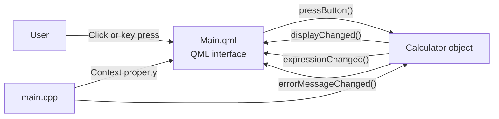
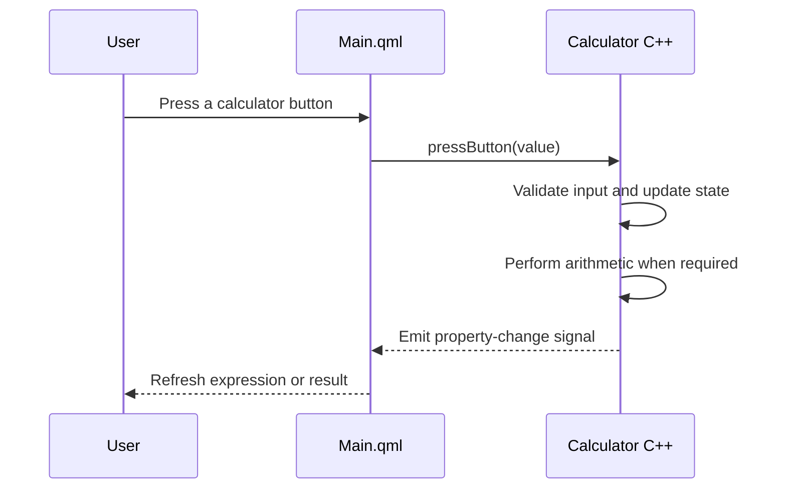

<div align="center">


# Qt 6 C++ Calculator

### A polished desktop calculator with a QML interface and C++ calculation engine

<p>
  
  
  
  
</p>

<p>
  <strong>Responsive UI</strong> • <strong>Backend arithmetic</strong> • <strong>Keyboard support</strong> • <strong>Error handling</strong>
</p>

</div>

---

## Overview

This project is a modern desktop calculator created with **Qt 6**, **Qt Quick**, **QML**, **C++17**, and **CMake**.

The application uses a clean separation of responsibilities:

- **QML** creates the window, display, keypad, colors, layout, and user interactions.
- **C++** stores the calculator state and performs every mathematical operation.
- A **context property** connects the C++ `Calculator` object to `Main.qml` without exposing implementation details in the interface.

The result is a maintainable application where presentation and business logic can evolve independently.

## Highlights

| Feature | Description |
| --- | --- |
| Modern interface | Premium dark theme with gold accents and responsive controls |
| C++ calculation engine | Arithmetic and calculator state never live inside QML |
| Live QML bindings | The display refreshes automatically when C++ properties change |
| Chained calculations | Supports continuous input such as `2 + 3 + 4` using immediate execution |
| Safe division | Detects division by zero and displays a helpful error |
| Input protection | Limits very long input and rejects invalid or non-finite results |
| Mouse and keyboard | Works through both the on-screen keypad and physical keyboard |
| Reusable architecture | The backend can be connected to a redesigned UI without rewriting its logic |

## Architecture



### Responsibility map

| Layer | Files | Responsibility |
| --- | --- | --- |
| Presentation | `Main.qml` | Layout, colors, keypad, display, mouse and keyboard events |
| Connection | `main.cpp` | Creates the backend and exposes it to QML |
| Business logic | `calculator.h`, `calculator.cpp` | State, validation, operators, results and errors |
| Build system | `CMakeLists.txt` | Configures Qt, QML, C++17 and the executable target |

## How C++ communicates with QML

### 1. Create the backend

`main.cpp` creates one `Calculator` object:

```cpp
Calculator calculatorBackend;
```

### 2. Expose it as a context property

The object is added to the QML context under the name `calculator`:

```cpp
engine.rootContext()->setContextProperty(
    QStringLiteral("calculator"),
    &calculatorBackend
);
```

### 3. Send input from QML

The interface does not calculate anything. It sends the pressed button to C++:

```qml
onClicked: calculator.pressButton(modelData.text)
```

### 4. Display C++ data

QML reads the backend properties through normal bindings:

```qml
text: calculator.display
text: calculator.expression
```

When C++ emits `displayChanged()`, `expressionChanged()`, or `errorMessageChanged()`, the bound QML elements update automatically.

## Supported operations

| Button | Operation | Example |
| :---: | --- | --- |
| `+` | Addition | `12 + 8 = 20` |
| `−` | Subtraction | `20 − 7 = 13` |
| `×` | Multiplication | `6 × 9 = 54` |
| `÷` | Division | `81 ÷ 9 = 9` |
| `%` | Convert to percentage | `25 % = 0.25` |
| `±` | Change number sign | `8 → −8` |
| `.` | Enter a decimal number | `3.14` |
| `⌫` | Remove the last character | `125 → 12` |
| `C` | Clear all calculator state | Returns to `0` |
| `=` | Calculate the result | Completes the expression |

## Keyboard controls

| Keyboard input | Action |
| --- | --- |
| `0`–`9` | Enter a digit |
| `+`, `-`, `*`, `/` | Select an arithmetic operation |
| `.` | Add a decimal point |
| `%` | Convert the displayed value to a percentage |
| `Enter` or `=` | Calculate the result |
| `Backspace` or `Delete` | Remove the last digit |
| `Esc` or `C` | Clear the calculator |

## Project structure

```text
Qt6_Backend_Calculator/
├── assets/
│   └── calculator-preview.svg   # README hero graphic
├── calculator.h                 # Backend class declaration
├── calculator.cpp               # Calculator logic and state
├── main.cpp                     # Application entry and QML connection
├── Main.qml                     # Complete graphical interface
├── CMakeLists.txt               # Qt and CMake configuration
└── README.md                     # Project documentation
```

## Requirements

- **Qt 6.5 or newer**
- **Qt Quick**
- **Qt Quick Controls 2**
- **CMake 3.16 or newer**
- A compiler with **C++17** support

The project can run on Linux, Windows, and macOS when a matching Qt Desktop kit is installed.

## Run with Qt Creator

1. Open **Qt Creator**.
2. Select **File → Open File or Project**.
3. Choose the project's `CMakeLists.txt`.
4. Select a **Qt 6.5+ Desktop kit**.
5. Press **Configure Project**.
6. Build the project with **Ctrl+B**.
7. Run it with **Ctrl+R**.

## Build from the terminal

```bash
git clone <your-repository-url>
cd Qt6_Backend_Calculator
cmake -S . -B build
cmake --build build --parallel
./build/appCalculator
```

On Windows, run the generated `appCalculator.exe` from the selected build configuration directory.

## Calculation flow



## Error handling

The C++ backend handles invalid calculator states before they reach the UI:

- Division by zero displays **Cannot divide by zero**.
- Invalid numeric conversion displays **Invalid number**.
- Infinite or overflowing results display **Result is too large**.
- Pressing a digit after an error automatically starts a clean calculation.

## Design system

| Role | Color | Hex |
| --- | :---: | --- |
| Application background | Dark navy | `#0B1118` |
| Surface | Deep blue-gray | `#111A24` |
| Primary accent | Warm gold | `#F2B84B` |
| Main text | Soft white | `#F4F6F8` |
| Secondary text | Slate | `#758999` |
| Error state | Soft red | `#FF8585` |

## Possible future improvements

- Calculation history
- Memory controls: `MC`, `MR`, `M+`, and `M−`
- Scientific calculator mode
- Unit tests using Qt Test
- English and Arabic localization with Qt Linguist
- Theme switching

---

<div align="center">

Built with **Qt 6**, **QML**, and **C++17**.

If this project helps you, consider giving the repository a ⭐.

</div>
....