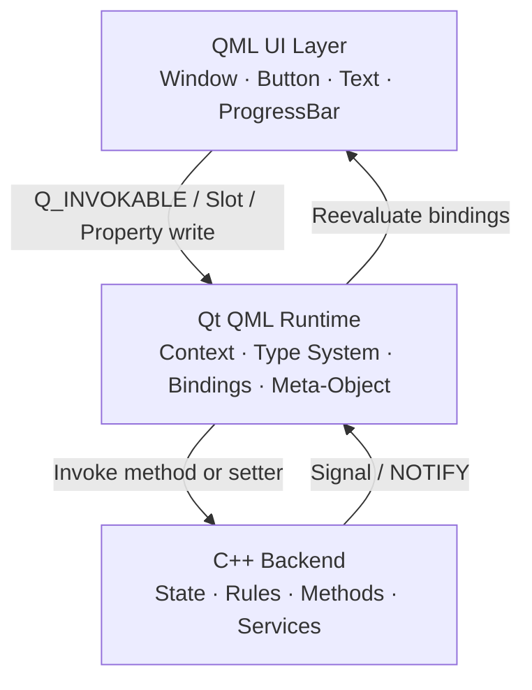
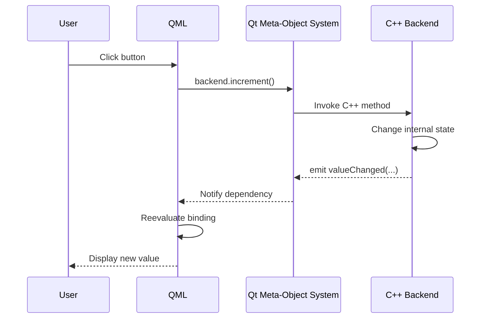
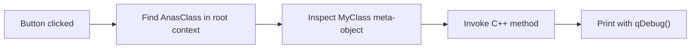
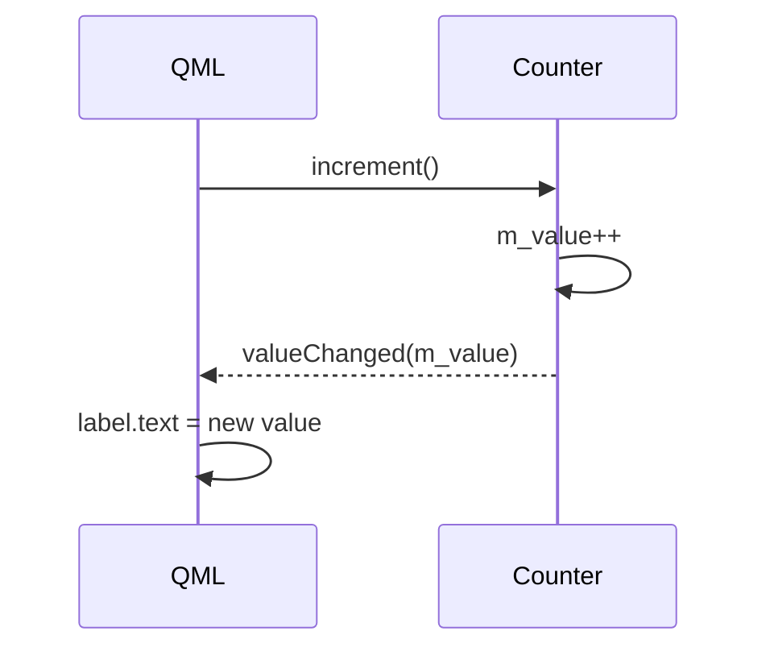
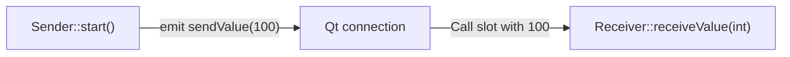
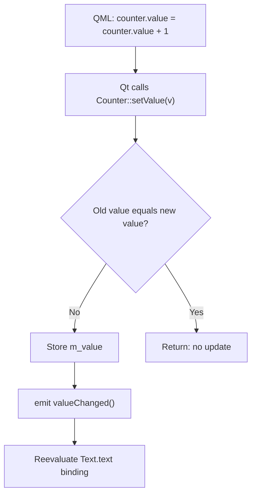
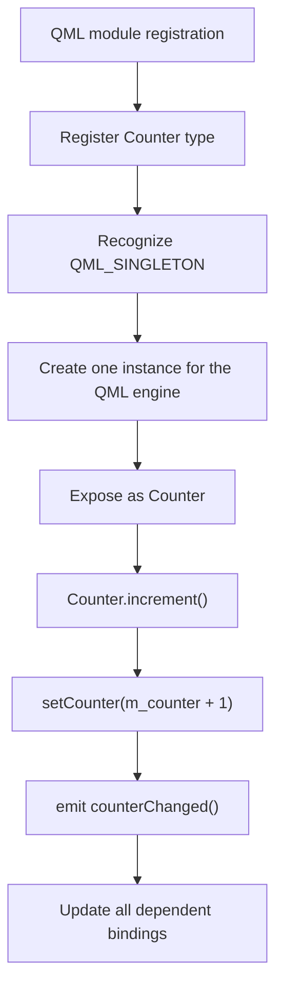
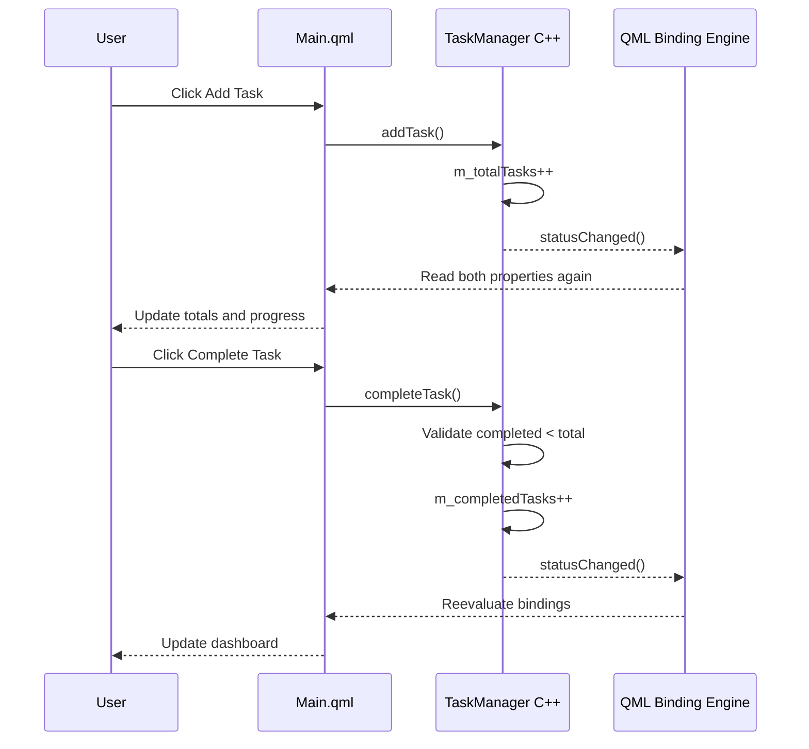
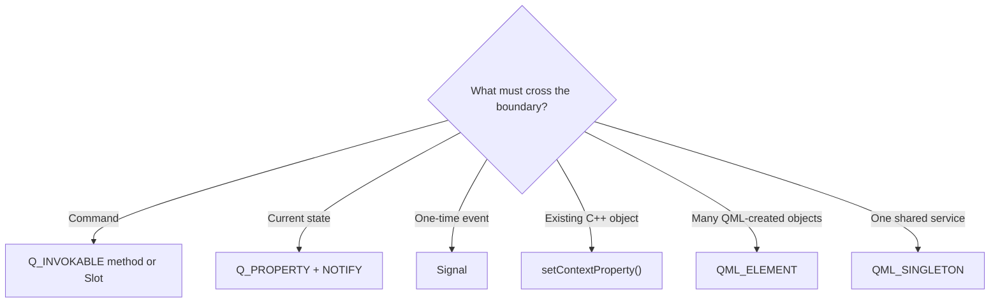

<div align="center">
  

  <br>

  <a href="https://www.qt.io/"></a>
  
  
  
  <a href="../../LICENSE"></a>

  <h3>A practical, progressive guide to every major connection between a Qt Quick frontend and a C++ backend.</h3>

  <p>
    <a href="#-learning-roadmap">Learning Roadmap</a> •
    <a href="#-communication-map">Communication Map</a> •
    <a href="#-connection-techniques">Connection Techniques</a> •
    <a href="#-task-manager-application">Task Manager</a> •
    <a href="#-build-and-run">Build & Run</a>
  </p>
</div>

---

## ✨ Overview

Qt Quick applications are strongest when each layer does the job it was designed for:

- **QML** owns the visual interface, animations, bindings, and user interaction.
- **C++** owns business rules, data processing, services, hardware access, and performance-critical work.
- The **Qt Meta-Object System** connects both layers through properties, methods, signals, slots, and registered QML types.

This repository presents the concepts in small projects and then combines them in a **Task Manager application**. It demonstrates:

- `setContextProperty()`
- `Q_INVOKABLE`
- Signals and Slots
- `Connections` in QML
- `Q_PROPERTY`, getters, setters, and `NOTIFY`
- Reactive QML property bindings
- `QML_ELEMENT`
- `QML_SINGLETON`
- A complete QML ↔ C++ application flow

> [!TIP]
> Use this rule when designing a Qt backend: **command → method**, **event → signal**, **state → property**.

---

## 🧭 Learning Roadmap

| Order | Project | Main concept | Communication |
|:---:|---|---|---|
| `00` | `propertiesContext` | Expose an existing C++ object | QML → C++ |
| `01-A` | `signalSlot_FrontBack` | Call C++, then receive a C++ signal | QML ↔ C++ |
| `01-B` | `signal_slot_backEndOnly` | Connect two C++ objects | C++ → C++ |
| `02` | `QProperty_propertyBinding` | Reactive C++ state | QML ↔ C++ |
| `03` | `QML_Element` | Create a registered C++ type in QML | QML owns instance |
| `04` | `singleton` | Use one shared backend object | Shared backend |
| `05` | `taskManagerApp` | Combine methods, properties, bindings, and UI | Complete app |


---

## 🏗️ Architecture



### The invisible bridge: Qt Meta-Object System

Classes participating in QML communication normally inherit `QObject` and use `Q_OBJECT`:

```cpp
class Backend : public QObject
{
    Q_OBJECT
};
```

During the build, Qt's **Meta-Object Compiler (`moc`)** generates metadata and supporting C++ code. This enables runtime discovery of:

| Feature | Purpose |
|---|---|
| `Q_OBJECT` | Enables meta-object features for the class |
| `Q_INVOKABLE` | Makes a method callable through the meta-object system |
| `signals` | Declares event notifications |
| `slots` | Declares functions designed to receive signals |
| `Q_PROPERTY` | Exposes observable C++ state |
| `QML_ELEMENT` | Registers a constructible C++ type in a QML module |
| `QML_SINGLETON` | Provides a shared instance through the QML type system |

---

## 🗺️ Communication Map

| Direction | Mechanism | Use it for | QML example |
|---|---|---|---|
| QML → C++ | `Q_INVOKABLE` | Commands and operations | `backend.save()` |
| QML → C++ | Public Slot | A callable signal receiver | `backend.reset()` |
| QML → C++ | `Q_PROPERTY WRITE` | Changing state | `backend.value = 10` |
| C++ → QML | Signal + `Connections` | Events carrying optional data | `onValueChanged(value)` |
| C++ → QML | `Q_PROPERTY + NOTIFY` | Reactive, persistent state | `text: backend.value` |
| C++ → C++ | Signal → Slot | Decoupled backend objects | `QObject::connect(...)` |
| QML → QML | Property binding | Derived UI state | `enabled: backend.ready` |



---

## 📁 Project Structure

```text
Qml_Cpp_Comm/
├── README.md
├── 00.propertiesContext/
│   ├── CMakeLists.txt
│   ├── main.cpp
│   ├── myclass.h
│   ├── myclass.cpp
│   └── Main.qml
├── 01.SignalSlots/
│   ├── signalSlot_FrontBack/
│   └── signal_slot_backEndOnly/
├── 02.QProperty_propertyBinding/
├── 03.QML_Element/
├── 04.Singletone/
│   └── singleton/
└── 05.taskManagerApp/
    ├── CMakeLists.txt
    ├── main.cpp
    ├── taskmanager.h
    ├── taskmanager.cpp
    ├── Main.qml
    ├── background.qrc
    └── background.webp
```

---

# 🔌 Connection Techniques

## 1. Context Property — expose an existing C++ object

**Project:** `00.propertiesContext`

### What it solves

C++ creates and owns a specific object, but QML needs to call its methods. `setContextProperty()` inserts a reference to that object into the QML context.

### C++ exposure

```cpp
MyClass myclass;

engine.rootContext()->setContextProperty(
    "AnasClass",
    &myclass
);
```

- `"AnasClass"` is the name visible in QML.
- `&myclass` is the address of the existing C++ object.
- QML receives access to the same object; no second `MyClass` object is created.
- The object must remain alive while QML uses it. In this project, both the object and engine live inside `main()` until the event loop ends.

### Exposed functions

```cpp
Q_INVOKABLE void sayHelloInvokable();

public slots:
    void sayHelloSlot();
```

### QML usage

```qml
Button {
    text: "Call INVOKABLE"
    onClicked: AnasClass.sayHelloInvokable()
}

Button {
    text: "Call SLOT"
    onClicked: AnasClass.sayHelloSlot()
}
```

### Execution flow



### Expected output

```text
Hello from INVOKABLE
Hello from SLOT
```

### When to use it

Use a context property when C++ must create, configure, or own a particular application object. Avoid filling the root context with many unrelated objects; QML modules scale more cleanly.

---

## 2. `Q_INVOKABLE` — call a C++ command from QML

```cpp
Q_INVOKABLE void increment();
```

After the object becomes visible to QML:

```qml
onClicked: counter.increment()
```

At runtime, QML resolves `counter`, searches its meta-object for `increment()`, converts arguments to the declared C++ types, and invokes the method.

> [!IMPORTANT]
> `Q_INVOKABLE` exposes a **method**, not an object. The object must still reach QML through a context property, a registered QML type, or a singleton.

### `Q_INVOKABLE` or Slot?

Both are callable from QML. Prefer the declaration that communicates intent:

- Use `Q_INVOKABLE` for a method exposed as an operation or command.
- Use a Slot when the function conceptually receives and responds to a signal.

Slots are not obsolete in Qt 6.

---

## 3. Signals and Slots — frontend and backend

**Project:** `01.SignalSlots/signalSlot_FrontBack`

This example demonstrates both directions:

1. QML calls `Counter::increment()`.
2. C++ changes `m_value`.
3. C++ emits `valueChanged(m_value)`.
4. QML receives the signal with `Connections`.
5. QML updates the label.

### C++ sender

```cpp
class Counter : public QObject
{
    Q_OBJECT

public:
    Q_INVOKABLE void increment();

signals:
    void valueChanged(int value);

private:
    int m_value = 0;
};
```

```cpp
void Counter::increment()
{
    m_value++;
    emit valueChanged(m_value);
}
```

### QML receiver

```qml
Button {
    text: "Increment"
    onClicked: counter.increment()
}

Connections {
    target: counter

    function onValueChanged(value) {
        label.text = "Value: " + value
    }
}
```

### Signal handler naming

```text
C++ signal:  valueChanged
QML handler: onValueChanged
```

The `value` argument emitted by C++ becomes the handler's `value` parameter in QML.



### Why use a signal?

The backend announces an event without knowing which visual element will react. One signal can notify zero, one, or many receivers.

---

## 4. Signals and Slots — backend only

**Project:** `01.SignalSlots/signal_slot_backEndOnly`

Signals and Slots are not limited to QML communication. Two C++ objects can communicate without depending directly on each other's implementation.

### Sender

```cpp
signals:
    void sendValue(int value);
```

```cpp
void Sender::start()
{
    emit sendValue(100);
}
```

### Receiver

```cpp
public slots:
    void receiveValue(int value);
```

```cpp
void Receiver::receiveValue(int value)
{
    qDebug() << "Receiver got value:" << value;
}
```

### Connection

```cpp
QObject::connect(
    &sender,
    &Sender::sendValue,
    &receiver,
    &Receiver::receiveValue
);
```

Read the arguments as:

```text
sender object → sender signal → receiver object → receiver slot
```

When `sender.start()` emits `sendValue(100)`, Qt calls `receiver.receiveValue(100)`.



> [!NOTE]
> In this teaching example, the GUI engine and QML window are commented out. The example sends one value, prints it, and exits. `Main.qml` is also fully commented.

---

## 5. `Q_PROPERTY` — reactive C++ state

**Project:** `02.QProperty_propertyBinding`

### What it solves

A private C++ variable is invisible to QML. `Q_PROPERTY` creates a controlled, observable interface around that state.

```cpp
Q_PROPERTY(
    int value
    READ getValue
    WRITE setValue
    NOTIFY valueChanged
)
```

| Part | Meaning | QML effect |
|---|---|---|
| `int` | Property type | QML receives an integer |
| `value` | Public property name | `counter.value` |
| `READ getValue` | Getter | QML can read the value |
| `WRITE setValue` | Setter | QML can assign a value |
| `NOTIFY valueChanged` | Change signal | Bindings can update |

### C++ implementation

```cpp
int Counter::getValue() const
{
    return m_value;
}

void Counter::setValue(int v)
{
    if (m_value == v)
        return;

    m_value = v;
    emit valueChanged();
}
```

The equality check prevents unnecessary signals when the value does not actually change.

### QML binding and write

```qml
Text {
    text: "Value: " + counter.value
}

Button {
    text: "Increase"
    onClicked: counter.value = counter.value + 1
}
```

The assignment calls the C++ setter. The setter changes `m_value`, emits `valueChanged()`, and causes the `Text.text` binding to be reevaluated.



> [!WARNING]
> Writing `m_value = v` without emitting the declared `NOTIFY` signal changes C++ memory, but dependent QML bindings may keep displaying the old value.

### Read-only property

Omit `WRITE` when QML must not change the state directly:

```cpp
Q_PROPERTY(int total READ total NOTIFY totalChanged)
```

---

## 6. `QML_ELEMENT` — create C++ objects in QML

**Project:** `03.QML_Element`

`QML_ELEMENT` registers a C++ class as a type in the module created by `qt_add_qml_module()`.

```cpp
#include <QtQml/qqml.h>

class Counter : public QObject
{
    Q_OBJECT
    QML_ELEMENT

    Q_PROPERTY(
        int value
        READ value
        WRITE setValue
        NOTIFY valueChanged
        FINAL
    )

    // ...
};
```

The CMake module uses the URI `qmlElement`:

```cmake
qt_add_qml_module(appQML_ELEMENT
    URI qmlElement
    QML_FILES
        Main.qml
    SOURCES
        counter.h
        counter.cpp
)
```

QML imports the module and creates an instance:

```qml
import qmlElement

Counter {
    id: counter
}
```

### Ownership model

Here, QML creates the `Counter` instance. With two declarations, QML creates two independent C++ objects:

```qml
Counter { id: firstCounter }
Counter { id: secondCounter }
```

Changing `firstCounter.value` does not change `secondCounter.value`.

### When to use it

Use `QML_ELEMENT` for types that QML should instantiate, including:

- Independent controllers
- Models
- Device objects
- Reusable backend-aware components

---

## 7. `QML_SINGLETON` — one shared backend service

**Project:** `04.Singletone/singleton`

> [!NOTE]
> The repository directory is named `Singletone`; the standard spelling is **Singleton**.

```cpp
class Counter : public QObject
{
    Q_OBJECT
    QML_ELEMENT
    QML_SINGLETON

    Q_PROPERTY(
        int counter
        READ counter
        WRITE setCounter
        NOTIFY counterChanged
    )

public:
    Q_INVOKABLE void increment();

    // ...
};
```

QML accesses the shared object through the type name:

```qml
Text {
    text: "Counter: " + Counter.counter
}

Button {
    text: "Increment"
    onClicked: Counter.increment()
}
```

There is no object declaration such as `Counter {}`. The QML engine supplies the singleton instance when it is first needed.



### Singleton or regular element?

| Feature | `QML_ELEMENT` | `QML_SINGLETON` |
|---|---|---|
| Instances | Multiple | One per QML engine |
| State | Independent per object | Shared in that engine |
| QML syntax | `Counter { id: c }` | `Counter.counter` |
| Ownership | QML-created object | Engine-managed instance |
| Best for | Models, controllers, devices | Settings, auth, logger, shared service |

> [!CAUTION]
> Use singletons only for genuinely shared services. Too much global state creates hidden dependencies and makes testing harder.

---

# ✅ Task Manager Application

**Project:** `05.taskManagerApp`

The final example combines the major techniques in a practical interface:

- `TaskManager` is exposed with `QML_ELEMENT`.
- QML creates its own `TaskManager` instance.
- QML calls C++ with `Q_INVOKABLE` methods.
- C++ exposes read-only state through `Q_PROPERTY`.
- One `statusChanged()` signal notifies both properties.
- QML bindings update text and progress automatically.
- Qt Quick Controls use the Material style.
- A `.qrc` file embeds the background image.

## Backend API

```cpp
class TaskManager : public QObject
{
    Q_OBJECT
    QML_ELEMENT

    Q_PROPERTY(
        int totalTasks
        READ getTotalTasks
        NOTIFY statusChanged
    )

    Q_PROPERTY(
        int completedTasks
        READ getCompletedTasks
        NOTIFY statusChanged
    )

public:
    Q_INVOKABLE void addTask();
    Q_INVOKABLE void completeTask();

signals:
    void statusChanged();

private:
    int m_totalTasks = 0;
    int m_completedTasks = 0;
};
```

Both properties are read-only from QML because they have no `WRITE` entry. State can change only through the backend's rules.

## Business logic

```cpp
void TaskManager::addTask()
{
    m_totalTasks++;
    emit statusChanged();
}

void TaskManager::completeTask()
{
    if (m_completedTasks < m_totalTasks) {
        m_completedTasks++;
        emit statusChanged();
    }
}
```

The condition prevents the number of completed tasks from exceeding the total number of tasks.

## QML instance and actions

```qml
import taskManager

TaskManager {
    id: taskManager
}

Button {
    text: "Add Task"
    onClicked: taskManager.addTask()
}

Button {
    text: "Complete Task"
    onClicked: taskManager.completeTask()
}
```

## Reactive dashboard

```qml
Text {
    text: "Total Tasks: " + taskManager.totalTasks
}

Text {
    text: "Completed Tasks: " + taskManager.completedTasks
}

ProgressBar {
    value: taskManager.totalTasks === 0
           ? 0
           : taskManager.completedTasks / taskManager.totalTasks
}
```

The ternary expression avoids division by zero when there are no tasks.

## Complete interaction flow



## Resource and style setup

The resource file embeds the background:

```xml
<RCC>
    <qresource prefix="/">
        <file>background.webp</file>
    </qresource>
</RCC>
```

QML accesses it through the Qt resource system:

```qml
Image {
    anchors.fill: parent
    source: "qrc:/background.webp"
}
```

The Material style is selected before creating `QGuiApplication`:

```cpp
QQuickStyle::setStyle("Material");
QGuiApplication app(argc, argv);
```

This affects visual styling only; it does not change QML ↔ C++ communication.

---

## 🧠 Choosing the Correct Technique



### Practical examples

| Requirement | Recommended design |
|---|---|
| Save settings | `Q_INVOKABLE void saveSettings()` |
| Current username | `Q_PROPERTY(QString username ... NOTIFY usernameChanged)` |
| Login failed | `signal loginFailed(QString message)` |
| Shared application settings | `QML_SINGLETON` service |
| Ten independent smart-home devices | `QML_ELEMENT` objects or a model |
| Existing database service created in C++ | Context property or registered singleton instance |

---

## ⚙️ Build and Run

### Requirements

- Qt **6.8 or newer** — the projects call `qt_standard_project_setup(REQUIRES 6.8)`.
- CMake **3.16 or newer**.
- A compiler supported by your Qt installation.
- Qt components:
  - `Quick` for all examples.
  - `QuickControls2` for the Task Manager.

### Qt Creator

1. Open the `CMakeLists.txt` inside the example you want to run.
2. Select a Qt 6.8+ Desktop Kit.
3. Let Qt Creator configure the CMake project.
4. Press **Build**.
5. Press **Run**.

Each directory is a separate example project; do not open `Qml_Cpp_Comm` as though it contains one top-level `CMakeLists.txt`.

### Command line example

From `Qml_Cpp_Comm`:

```bash
cmake -S 00.propertiesContext -B build/properties-context
cmake --build build/properties-context --parallel
```

Task Manager:

```bash
cmake -S 05.taskManagerApp -B build/task-manager
cmake --build build/task-manager --parallel
```

If CMake cannot locate Qt, provide the Qt installation prefix:

```bash
cmake -S 05.taskManagerApp \
      -B build/task-manager \
      -DCMAKE_PREFIX_PATH=/path/to/Qt/6.8.x/gcc_64
```

Replace the example path with the actual Qt path on your computer.

---

## 🧯 Common Problems

<details>
<summary><strong>QML says: Property 'functionName' is not a function</strong></summary>

- Confirm the object is visible to QML.
- Mark the method `Q_INVOKABLE` or declare it as a public Slot.
- Keep `Q_OBJECT` in the class.
- Rebuild so `moc` regenerates the meta-object code.

</details>

<details>
<summary><strong>The C++ value changes, but the UI does not update</strong></summary>

- Add a `NOTIFY` signal to `Q_PROPERTY`.
- Emit that signal after the value actually changes.
- Do not directly modify the backing member from several places; route changes through one setter.
- Confirm the QML expression is still a binding and was not replaced by an imperative assignment.

</details>

<details>
<summary><strong>QML reports that Counter is unavailable or unknown</strong></summary>

- Include `<QtQml/qqml.h>`.
- Add `QML_ELEMENT`.
- List the header and source under `SOURCES` in `qt_add_qml_module()`.
- Use the correct module URI/import.
- Delete stale build output and configure the project again if registration code is outdated.

</details>

<details>
<summary><strong>A Singleton cannot be instantiated</strong></summary>

That is expected. Access it by type name:

```qml
Counter.increment()
```

Do not create it with:

```qml
Counter {}
```

</details>

<details>
<summary><strong>QML object creation fails at startup</strong></summary>

Every project connects `QQmlApplicationEngine::objectCreationFailed` to an exit handler. Read the Application Output for the earlier QML error; it usually identifies the file, line, missing import, or unavailable type that caused creation to fail.

</details>

---

## ✅ Best Practices

- Keep the UI declarative: derive visual properties through bindings.
- Keep business rules in C++, not scattered across button handlers.
- Expose state with `Q_PROPERTY` and a correct `NOTIFY` signal.
- Emit change signals only when a value really changes.
- Prefer read-only properties when QML should not bypass backend validation.
- Use methods for commands, signals for events, and properties for state.
- Use `QML_ELEMENT` when QML should create independent instances.
- Use `QML_SINGLETON` only for genuinely shared services.
- Use context properties intentionally; avoid turning the root context into an unstructured global namespace.
- Keep C++ objects alive for as long as QML holds references to them.
- Do not access QML visual objects directly from the backend unless there is a strong integration reason.
- Use `qt_add_qml_module()` for modern Qt 6 module and type registration.

---

## 🔍 Source Notes

- `01.SignalSlots/signal_slot_backEndOnly/Main.qml` is intentionally commented because that example demonstrates C++ → C++ communication only.
- The backend-only sample contains repeated empty `SOURCES` entries in `CMakeLists.txt`; these can be cleaned without changing the lesson.
- The folder name `04.Singletone` has a spelling mistake but is preserved here to match the repository path.
- A QML singleton is normally scoped to a QML engine. “One instance in the entire process” is not a safe assumption when an application owns multiple engines.
- A regular property binding is one-way. Two-way editing must be designed explicitly to avoid feedback loops.

---

## 📚 Further Reading

- [Qt: Overview — Integrating QML and C++](https://doc.qt.io/qt-6/qtqml-cppintegration-topic.html)
- [Qt: Exposing Attributes of C++ Types to QML](https://doc.qt.io/qt-6/qtqml-cppintegration-exposecppattributes.html)
- [Qt: Defining QML Types from C++](https://doc.qt.io/qt-6/qtqml-cppintegration-definetypes.html)
- [Qt: Properties](https://doc.qt.io/qt-6/properties.html)
- [Qt: Signals and Slots](https://doc.qt.io/qt-6/signalsandslots.html)
- [Qt: Building a QML Application with CMake](https://doc.qt.io/qt-6/cmake-build-qml-application.html)

---

## 📄 License

This repository is distributed under the [MIT License](../../LICENSE).

<div align="center">
  <strong>Build the interface in QML. Keep the logic in C++. Let Qt connect them.</strong>
  <br><br>
  <sub>Made for learning modern Qt 6 application architecture.</sub>
</div>
